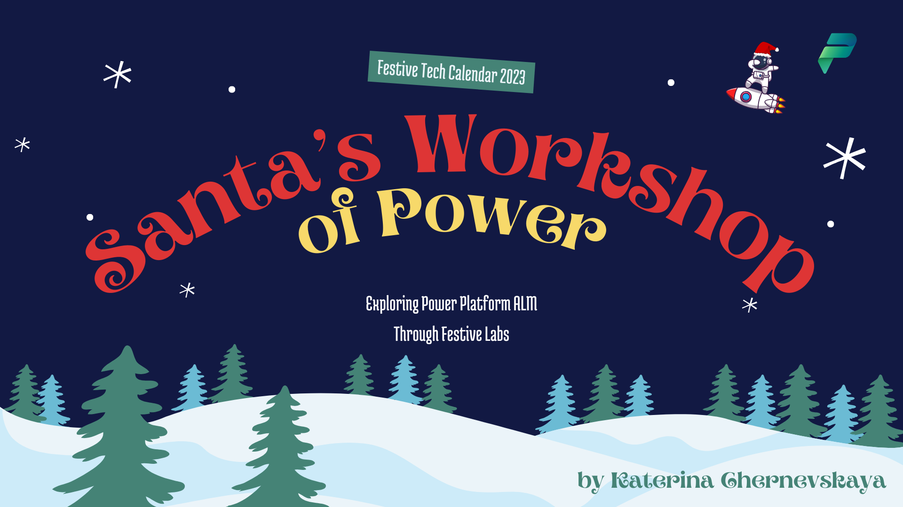
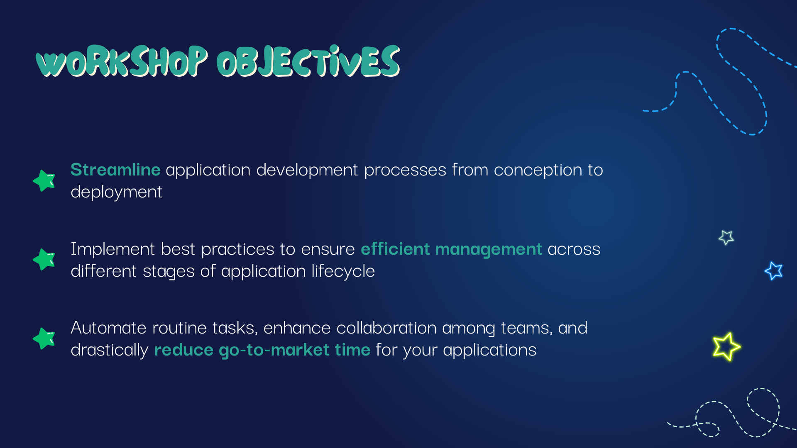
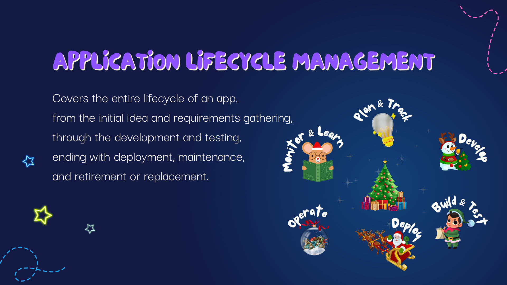
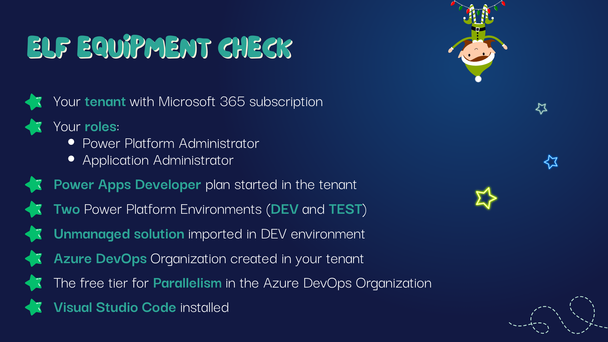

# Chapter 1: Intro

Ho-ho-ho! Welcome, dear elves, to the magical journey of Application Lifecycle Management in the Power Platform! As we embark on this sleigh ride together, we're not just decking the halls; we're decking out our apps with the best ALM practices. This workshop is your ticket to the North Pole of tech, where we'll unwrap the secrets to crafting delightful applications with the efficiency of Santa’s elves.

In Chapter 1, we're lighting up the tree by setting the stage for what lies ahead. Our goal is to transform how you think about and manage the lifecycle of your applications. From the spark of an idea to the joyous launch, we're here to guide you every step of the way. Let's embark on this adventure with our hearts full of cheer and minds eager to learn!

As we gather around the fireplace of innovation, let’s take a moment to behold the bright, shining objectives of our workshop. These three guiding stars will lead us through our Yuletide ALM Journey:

Streamline application development processes from conception to deployment: We aim to make the journey from an initial idea to a fully-functioning application as smooth as a sleigh ride on Christmas Eve.

Implement best practices to ensure efficient management across different stages of application lifecycle: Just as Santa relies on time-tested methods to ensure every gift is delivered on time, we'll adopt best practices that keep our development processes joyful and efficient.

Automate routine tasks, enhance collaboration among teams, and drastically reduce go-to-market time for your applications: We'll harness the magic of automation and teamwork to speed up our delivery times, ensuring our apps reach their audience faster than Santa traveling the globe.

These objectives are not just gifts under the tree; they're the foundation of our journey together. So, fasten your seatbelts, and let's dive into the world where tech meets tinsel, and ALM meets the magic of the holiday season!

---

## Understanding Application Lifecycle Management

Application Lifecycle Management (ALM) is akin to the journey of preparing for the grandest holiday celebration. It encompasses everything from the initial spark of an idea — like dreaming up the perfect holiday feast — to the final execution, which is akin to presenting the feast to your guests. In the realm of software development, ALM is this entire process: starting with the conception of an application, moving through its development and testing phases, and culminating in its release and ongoing maintenance.

In more technical terms, ALM integrates different aspects of software development into a cohesive whole. It includes project management, software development, quality assurance, and customer support. ALM doesn't just end with the launch of an application; it extends into the maintenance phase, ensuring the application evolves with changing needs and continues to deliver value.

The goal of ALM is to streamline and optimize each phase of this lifecycle. By doing so, we can make the process more efficient, reduce errors, and adapt more quickly to changes. This is akin to preparing for the holiday season well in advance, ensuring that each decoration is hung with care and every dish is cooked to perfection.

---

## Reminder About Prerequisites

Before we dive deeper into the world of ALM, let's pause to ensure that our sleigh is fully equipped for this journey. The prerequisites for this workshop are like the essential ingredients needed for our holiday feast; without them, we can't start cooking!

Please take a moment to check that everything is in place:

- Do you have an active tenant with a Microsoft 365 subscription? It's the kitchen where all our cooking (development) will happen.
- Are you assigned the roles of `Power Platform Administrator` and `Application Administrator`? These are akin to being the head chef, having access to all the tools and ingredients.
- Is your Power Apps Developer Plan active? This is like ensuring you have all the right recipes at hand.
Have you set up your two Power Platform environments (DEV and TEST)? Think of these as your preparation and tasting areas, essential for any great feast.
- Did you import the [unmanaged solution](./SantaStorage/NorthPoleCommunicationKit_1_0_0_1.zip) into your DEV environment? This is like having all your raw ingredients ready to be transformed into delicious dishes.
- Is your Azure DevOps Organization ready and waiting? This is your team of sous-chefs, all prepared to assist.
- Lastly, have you enabled the free tier for Parallelism in your Azure DevOps Organization? It's like having an extra pair of hands in the kitchen to help with multitasking.

If you find any of these prerequisites unchecked, please take a moment to address them (more details [here](./CheckPrerequisites.md)). They are crucial for a smooth and uninterrupted learning experience, just as every detail matters in preparing for the perfect holiday celebration.

---

With our checklist complete and all our prerequisites in place, it’s time to turn the page to the next exciting chapter in our ALM journey. If your sleigh is packed and your reindeer are ready, let’s glide seamlessly into [Chapter 2: Sleigh Solution Station](./Chapter2%20-%20Sleigh%20Solution%20Station.md), where we'll delve deeper into the enchanting world of Power Platform environments and solutions. Let the magic continue!

---

