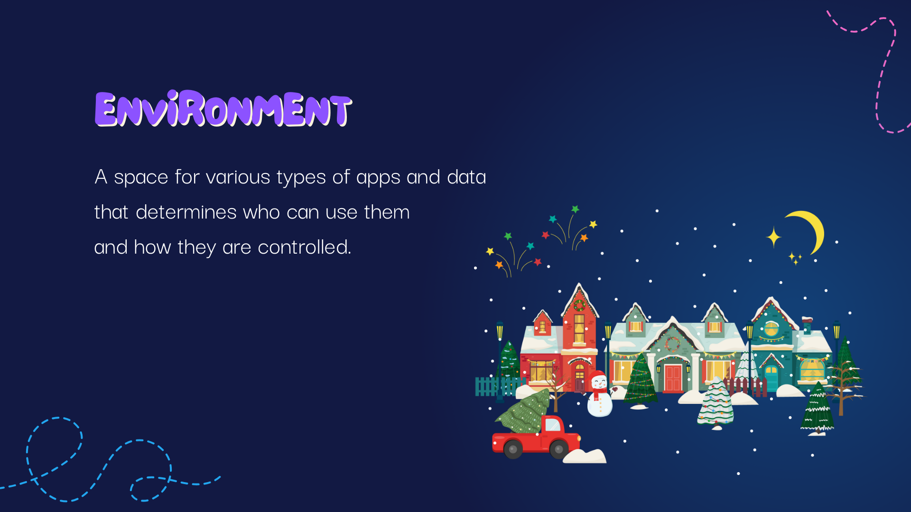
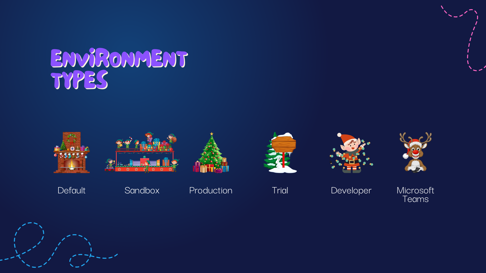
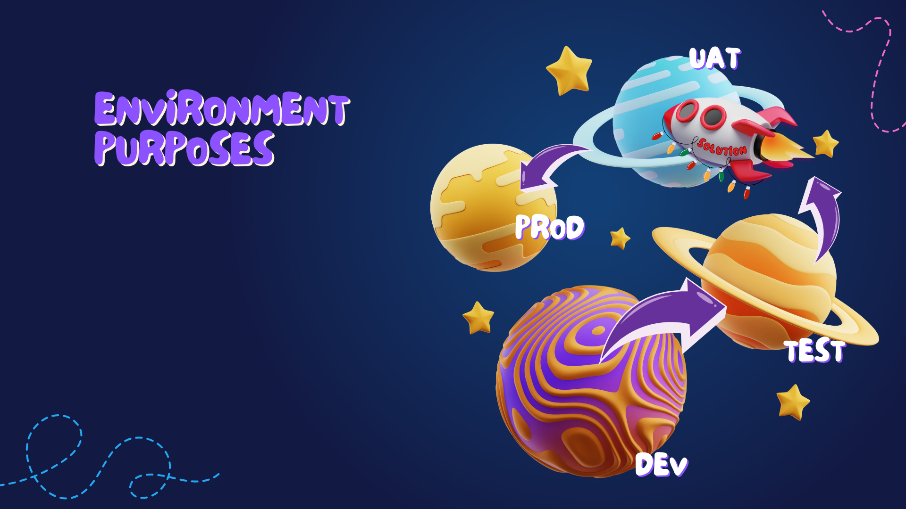
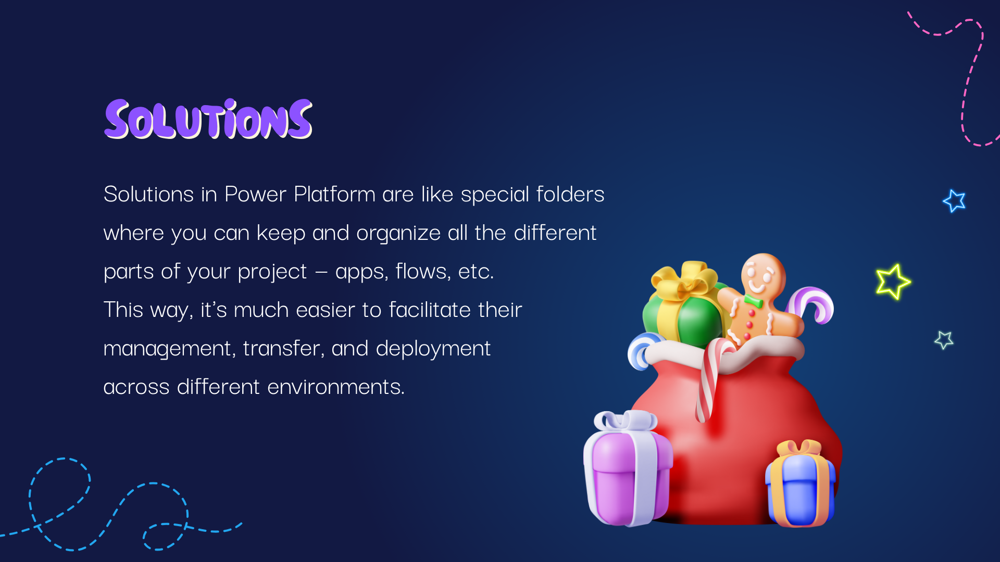
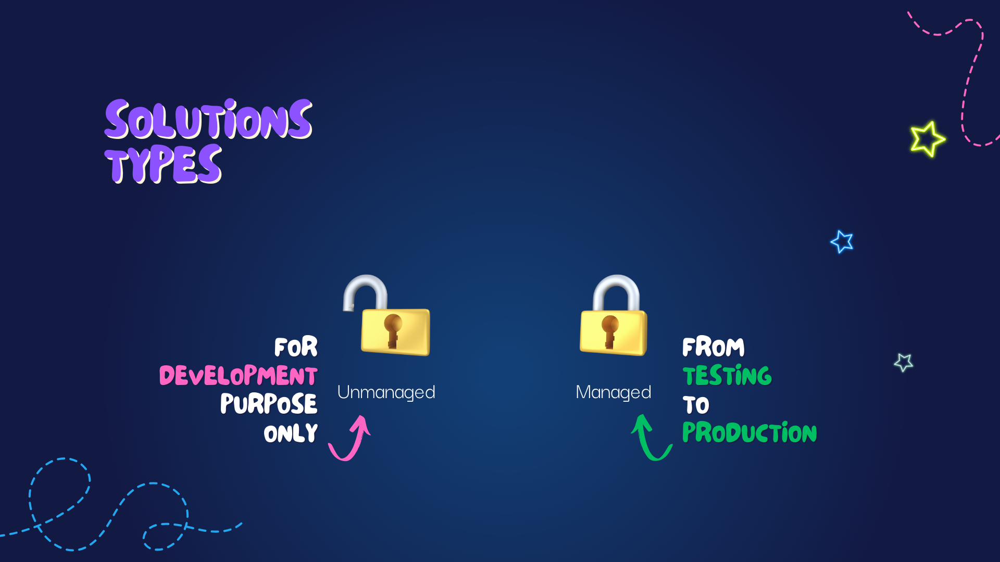
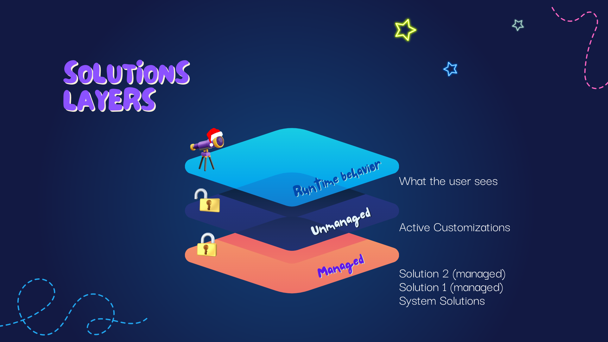
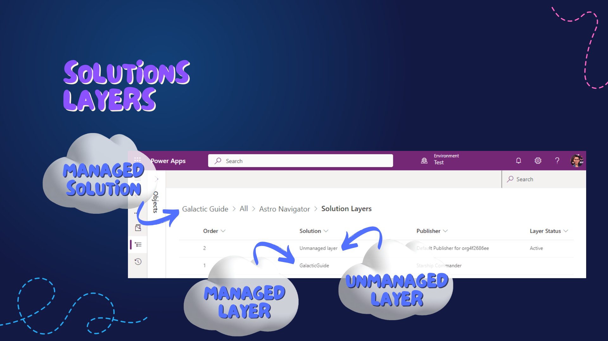

# Chapter 2: Sleigh Solution Station

Welcome to Chapter 2: Sleigh Solution Station!

In this chapter, we'll embark on a festive exploration of Power Platform's Environments and Solutions, akin to preparing our sleigh and packing the right gifts for a successful journey.

## What is an Environment?
Think of an Environment in Power Platform as a specific location in Santa's Workshop. It's where all the magic happens - where apps, data, and other elements are stored and managed. Environments provide a secure and isolated space, ensuring that the development and testing of your applications don't interfere with the production versions, much like how Santa's elves have separate areas for toy-making, wrapping, and dispatch.

---

## Types of Environments

In the Power Platform, there are six distinct types of environments, each serving a unique purpose in Santa's digital workshop:

- **Default Environment**: This is like the main hall of Santa’s workshop. It's the primary environment where everyone starts their journey and is shared across your organization. This environment is ideal for general-purpose work and initial explorations.

- **Sandbox Environment**: Think of this as the elves' experimental area. Here, they can test new toy designs (apps and solutions) in a safe, isolated space that mirrors the production environment. It's perfect for testing without affecting the live environment.

- **Production Environment**: The grand stage where the final toys are showcased. This environment is where your fully developed and tested applications go live. It’s the equivalent of Santa's final check before toys are delivered.

- **Trial Environment**: Consider this as a temporary display area for special, short-term projects. Trial environments are useful for trying out new ideas or features with a limited lifespan, much like a pop-up shop for holiday goodies.

- **Developer Environment**: This is a personal workspace, like each elf’s individual crafting table, where developers can build and test their applications independently. It's a non-production environment tailored for experimentation and development without risking the integrity of other environments.

- **Dataverse for Teams Environment**: Imagine a specialized corner in the workshop dedicated to specific teams. This environment is designed for building and using apps within the Microsoft Teams ecosystem, offering a streamlined and focused space for team-specific projects.

Each of these environments plays a crucial role in the lifecycle of Power Platform applications, much like different areas of Santa's workshop are essential for the journey of each toy from idea to delivery.

---

## Environment Purpose vs. Environment Type

Understanding the difference between environment type and purpose is crucial. The type of an environment (like Production, Test, or Development) refers to its configuration and capabilities. In contrast, the purpose is more about how you use it in your ALM process. It's like distinguishing between the various workshops in Santa's factory and their specific roles in the toy-making process.

---

## What is a Solution?
Moving on to Solutions in Power Platform, think of them as Santa’s sacks filled with all the necessary components (like apps, workflows, and data models) needed to deliver a specific functionality or process. Solutions are how you package and manage these components.

---

## Solution Types

**Managed Solutions**: These are like wrapped presents, ready to be delivered without further modification.

**Unmanaged Solutions**: These are akin to DIY toy kits, allowing customization and further development.

---

## Solution Layers

Solution layers in Power Platform are similar to the layers of wrapping paper on a present. Each layer represents changes or customizations made to the solution. With managed and unmanaged solutions, these layers behave differently:

**Managed Solution Layers**: Think of these as the final, sealed packaging of a toy. Once a solution is managed, it's like a toy that has been boxed and gift-wrapped, ready for delivery. In this state, the solution cannot be altered directly. Managed solutions are typically used in production environments where stability and consistency are paramount. They overlay unmanaged layers, but unlike wrapping paper, they don't merge with these layers; instead, they enforce the rules and customizations defined within them.

**Unmanaged Solution Layers**: These are more like toys still on the workbench, open to being tweaked and refined. In unmanaged layers, you can freely make and test changes. It's the space where most of the development and customization work happens. When you export a solution as unmanaged, it allows other developers to modify it further.

---

## Managed vs. Unmanaged Solution Layers

Understanding the difference between these is crucial for maintaining the integrity of your applications. Managed layers offer stability and consistency, much like how Santa ensures each gift is perfectly wrapped before delivery. Unmanaged layers offer flexibility, allowing you to tailor solutions to specific needs, similar to personalizing a gift.

In Power Platform, customizations to a managed solution are done in a separate unmanaged layer that sits on top of the managed layer. However, these customizations are not traditional "layers" that you can simply add on top of the managed solution; they are changes in the environment that the managed solution is aware of. When you update a managed solution, the update may overwrite or incorporate these customizations, depending on how the solution publisher has designed the update to behave.

Imagine your managed solution as a pre-lit Christmas tree, with lights securely affixed — that's the sturdy, unchangeable managed layer. You decide to personalize this tree by adding your own ornaments, which represent the unmanaged customizations you can make to suit your unique holiday vision.

Now, suppose the tree manufacturer sends you a new set of pre-lit branches — an update to the managed solution. Before you integrate these branches into your tree, you'll need to gently remove your ornaments, the unmanaged customizations, to avoid any mishaps. This step is crucial to ensure that your personal touches can be reapplied and adjusted to fit with the updated structure.

In the spirit of best practices, it's recommended to introduce and test all new features in the development environment, akin to crafting your ornaments in a workshop setting. When they're ready, and you're sure they'll dazzle and delight, it's time to move them to the production environment — the main stage of your home where the tree stands proud for all to see.

By adopting this method, you ensure that your customizations align with the managed solution's core updates, preserving the functionality and integrity of your solution throughout its lifecycle. It's a careful dance of innovation and maintenance, ensuring each new feature enhances the experience without disrupting the established harmony.

---

As we wrap up our time at the Sleigh Solution Station, we’ve packed our sleigh with knowledge about environments and solutions. Now, let's glide gracefully into [Chapter 3: DevOps Decoration Domain](./Chapter3%20-%20DevOps%20Decoration%20Domain.md), where we'll adorn our ALM journey with the sparkling lights of Azure DevOps, further enhancing our festive journey through the world of Power Platform.

---
