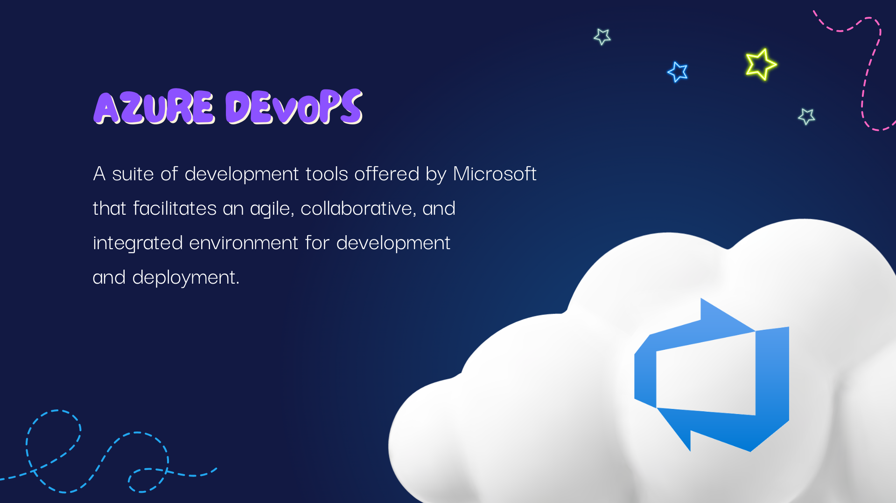
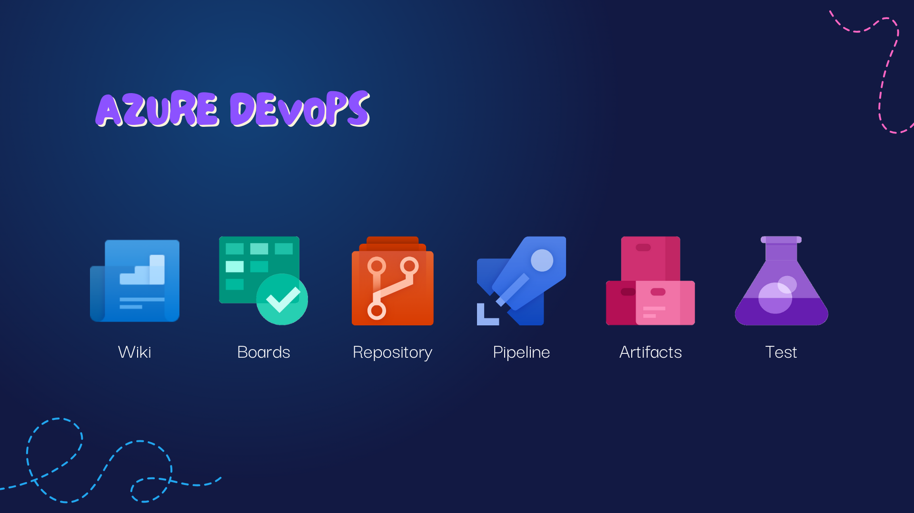
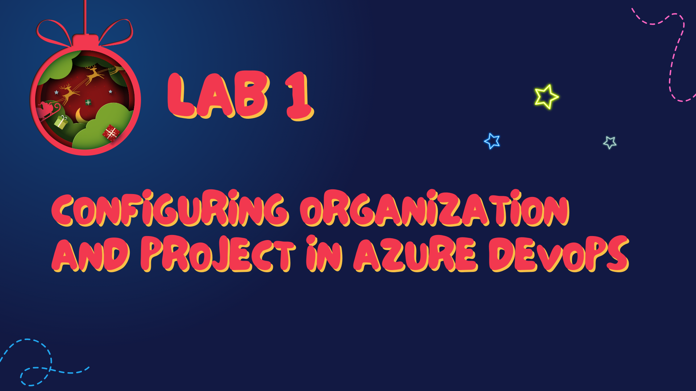

# Chapter 3: DevOps Decoration Domain

Welcome to Chapter 3: DevOps Decoration Domain, where we festoon our ALM practices with the sparkling tools and features of Azure DevOps. As we trim our development tree, let's familiarize ourselves with the ornaments of Azure DevOps that make our workflow not only merry but also bright and efficient.

---

## Azure DevOps: A Christmas Tree of Collaboration

Azure DevOps is like the central Christmas tree in the village square, where everyone comes together to contribute their part to the festive season. It's a platform that combines a suite of tools to support the entire application development lifecycle, from planning to deployment.

---

## Components of Azure DevOps

**Wiki**: This is the storybook of our tree, detailing the rich history and information behind each ornament. It’s a compendium of knowledge for your project, allowing team members to share documentation, notes, and guidance.

**Boards**: These are the planners and calendars that track what decorations (tasks) need to go up and when. They allow for agile planning, tracking work items, backlogs, and sprint planning, helping us see the big picture of our project timeline.

**Repository**: The repository is where we store all the tinsel and baubles (code) safely. This version control system is where your code lives, breathes, and is managed, allowing for collaboration without overwriting each other's work.

**Pipelines**: This is the process of stringing the lights, testing them, and making sure they dazzle before the big reveal. Pipelines automate the build and deployment process, ensuring that our code is always ready to shine.

**Artifacts**: After the lights are tested, they're stored here. Artifacts are the packages or components that are ready to be deployed. They can be stored, versioned, and fetched as part of the deployment process.

**Test Plans**: Before the lights go on, we need to ensure they twinkle just right. Test plans in Azure DevOps help us manage, execute, and track automated and manual tests, ensuring every bulb lights up as intended.

---

## First Lab: Configuring Organization and Project in Azure DevOps

Our first lab is akin to setting up our tree stand and ensuring it's stable. We will configure our organization and project in Azure DevOps, establishing the base from which all our festive activities will be orchestrated. This lab will guide you through:

- Creating and setting up your Azure DevOps organization.
- Initiating a new project where your team will collaborate.
- Familiarizing yourself with the Azure DevOps environment.

Once your organization and project are twinkling brightly, you'll be ready to step into the next chapter of our ALM winter tale.

[Go to the Lab 1](./labs/Lab%201%20-%20Configuring%20Organization%20and%20Project%20in%20Azure%20DevOps.md)

---

With our Azure DevOps tree now standing tall and proud, adorned with the tools to support our ALM efforts, it's time to prance over to [Chapter 4: Repository Reindeer Ridge](./Chapter4%20-%20Repository%20Reindeer%20Ridge.md). In the next chapter, we'll explore the storage and management of our code presents, ensuring they're neatly wrapped and ready for delivery. Let's carry on with our merry making, as our ALM journey continues to bring joy and efficiency to the world of application development.

---