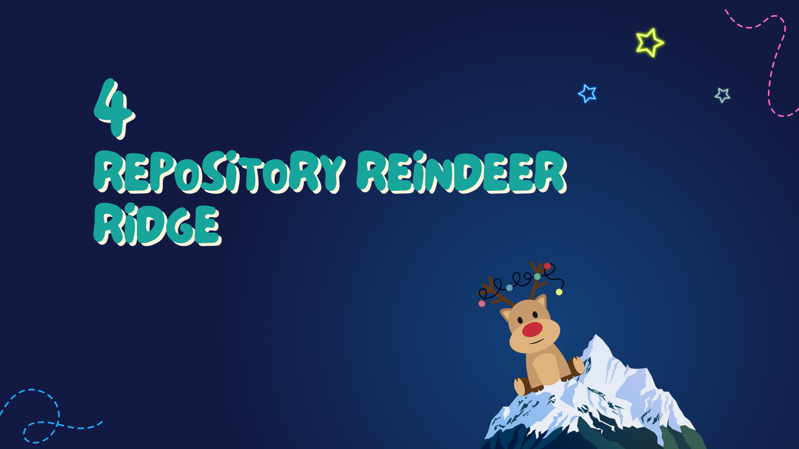
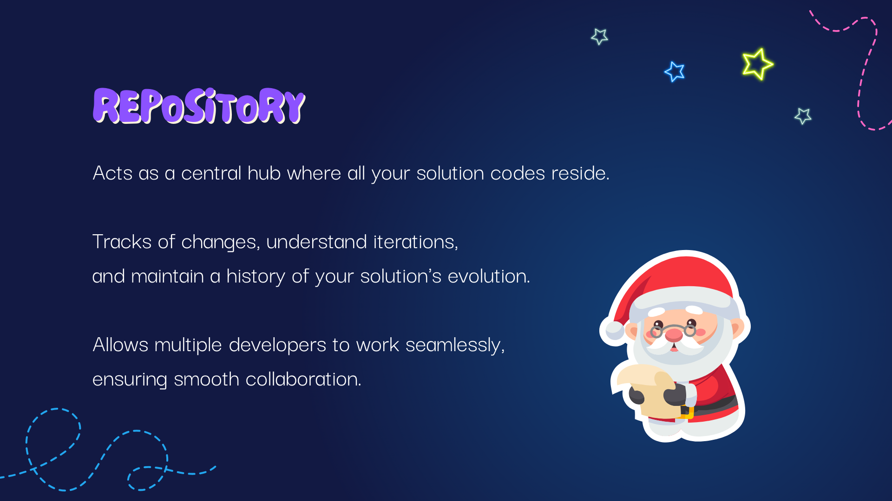
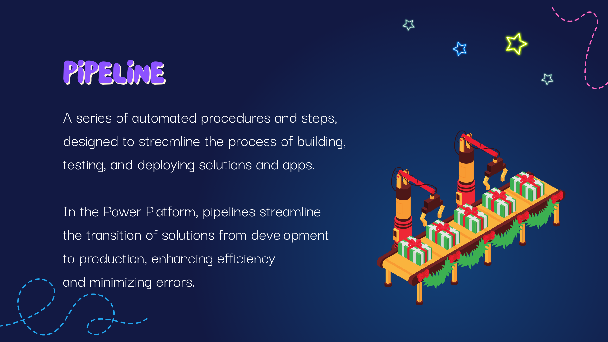
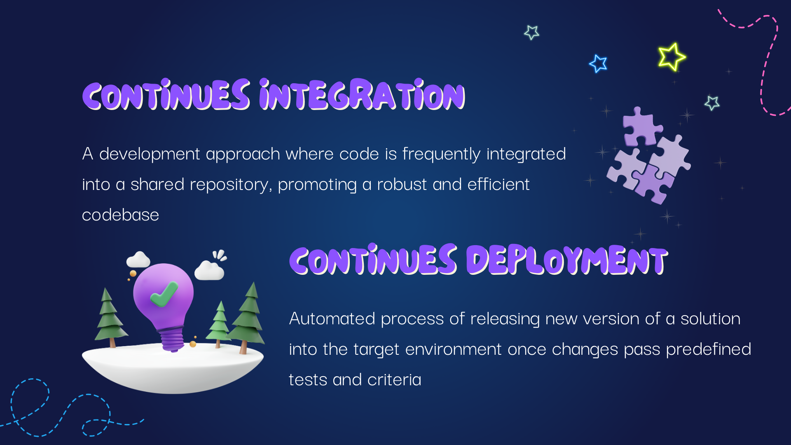
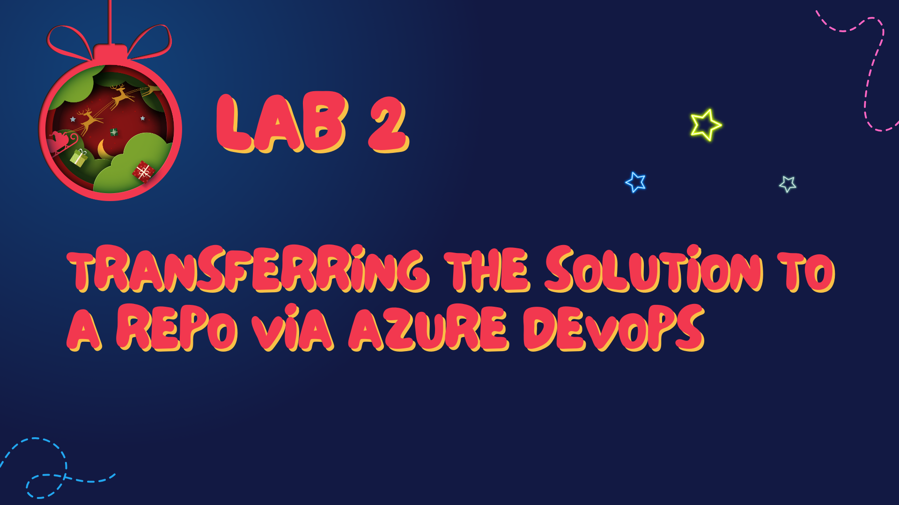

# Chapter 4: Repository Reindeer Ridge

As we journey further into our festive ALM landscape, we arrive at Chapter 4: Repository Reindeer Ridge, a place where diligent reindeer (developers) gather and organize gifts (code) in preparation for the grand sleigh ride (deployment).

---

## Repository: The Heart of the Workshop

A repository in Azure DevOps is like Santa's main sack where all the toys (code) are stored before the big night. It's a version control system that safely houses your code while allowing multiple elves (developers) to collaborate, make changes, and track the history of their crafting without fear of losing work or overriding each other's magical spells (code changes).

---

## Pipeline: The Assembly Line of Magic

In the world of ALM, a pipeline is the assembly line where toys (software builds) are constructed, wrapped, and sent down the chute for delivery. This automated process compiles all the code, runs tests (to ensure no toy is broken), and prepares it for release. 

It embodies the principles of continuous integration and continuous deployment:

**Continuous Integration (CI)**: Each time a piece of code is checked in, it's like adding a new bauble to the tree. CI ensures that this bauble fits perfectly with the others, testing and integrating it automatically with the rest of the decorations. This practice allows for frequent merges and early detection of issues, keeping the tree (codebase) harmonious and bright.

**Continuous Deployment (CD)**: After the baubles (software builds) are confirmed to be in harmony, CD is like the magic that happens when, at the push of a button, they are instantly and automatically placed on the tree in the perfect spot. This means that our software is deployed to production as soon as it's ready, without manual intervention, keeping the festive spirit alive with rapid updates.

---

## Second Lab: Transferring The Solution to a Repo via Azure DevOps

Now it's time for our second lab, where we'll put on our elf hats and transfer the solutions (gifts) to our repository (sleigh) via Azure DevOps. This lab will walk you through:

- Creating a new repository for your project.
- Storing your solutions in the repository, ready for the build and release processes.

By the end of this lab, you'll have a well-organized repository, a foundational understanding of pipelines, and a taste of the CI/CD magic that keeps our development cycle as exciting as Christmas Eve.

[Go to the Lab 2](./labs/Lab%202%20-%20Transferring%20the%20Solution%20to%20a%20Repository%20via%20Azure%20DevOps.md)

---

With our repository now bustling with activity and our solutions safely stored, we're ready to glide down to the next stop on our ALM adventure - [Chapter 5: Service Snowman Sanctum](./Chapter5%20-%20Service%20Snowman%20Sanctum.md). Let's harness our reindeer and make our way to the next chapter, where the magic of automation comes to life, bringing our applications ever closer to the eager users awaiting their arrival.

---