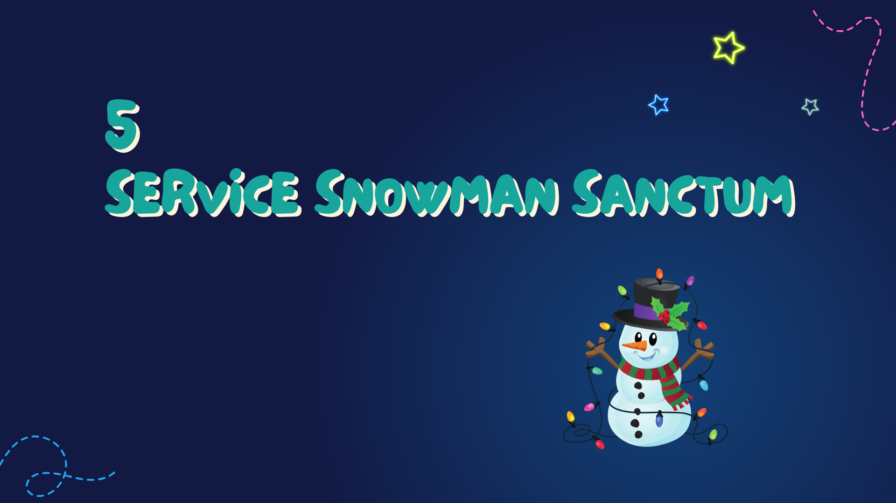
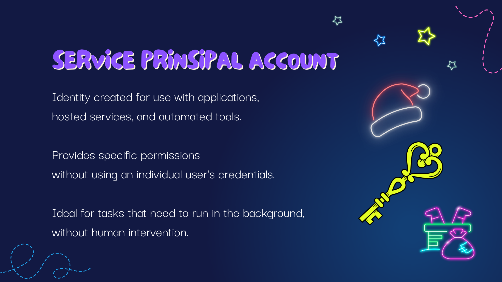
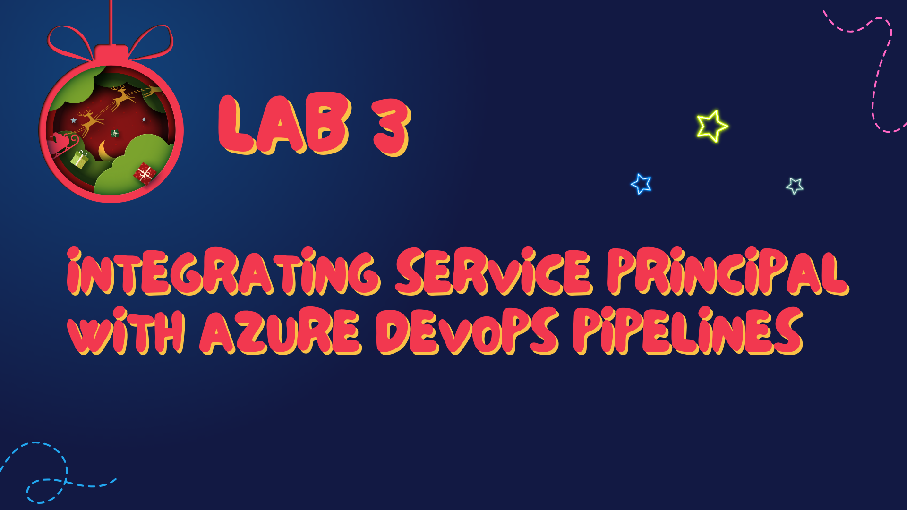

# Chapter 5: Service Snowman Sanctrum

Welcome to Chapter 5: Service Snowman Sanctum, a place of trust and security where we build a reliable friend — the Service Principal account — to assist us in the seamless delivery of our festive applications.

---

## Service Principal Account: Our Trusty Helper

In the realm of Azure and the Power Platform, a Service Principal account is like a dedicated snowman helper who has specific permissions and access rights to carry out tasks on your behalf. It's an identity created for use with applications, hosted services, and automated tools to access and manage Azure resources. Think of it as creating a magical helper with special access to perform certain tasks that even the busiest elves (developers) can't always attend to.

---

## Benefits of a Service Principal:

- **Security**: The Service Principal is a secure identity that follows the principle of least privilege, meaning it has only the permissions it absolutely needs — no more, no less. This helps to prevent any mischievous gremlins (security breaches) from causing chaos.

- **Automation**: With a Service Principal, many tasks can be automated, like sending out the sleigh (deploying updates) without needing Santa (a developer) to manually oversee each flight.

- **Continuous Operations**: It ensures that your workflows and operations can continue around the clock, even when the elves are asleep, leading to more efficient deployment cycles and operations.

- **MFA Environments**: For tenants with Multi-Factor Authentication (MFA), a Service Principal is essential. It's the only way to ensure automated processes can run securely and without interruption, much like a snowman who can withstand the storm, no matter the weather.

---

## Third Lab: Crafting Our Snowman for Azure DevOps Pipelines

In our third lab, we'll wrap up warmly and step into the snow to craft our very own Service Principal. This lab will guide you through:

- Creating a Service Principal account in Azure.
- Integrating the Service Principal with Azure DevOps pipelines, giving it the permissions to perform deployments and other tasks.
- Configuring your pipelines to use the Service Principal, ensuring that all operations are secure and automated.

By the end of this session, you'll have a Service Principal that's fully integrated with your Azure DevOps pipelines, ready to take on the heavy lifting and keep your development cycle running smoothly.

[Go to the Lab 3](./labs/Lab%203%20-%20Integrating%20Service%20Principal%20with%20Azure%20DevOps%20Pipelines.md)

---

With our Service Snowman now part of the team, our workshop is more secure and our processes are more automated than ever. Let's bid farewell to our frosty friend and move on to [Chapter 6: Automation Arctic](./Chapter6%20-%20Automation%20Arctic.md). There, we'll delve into the enchanting world of automating updates for environment variables and connection references, ensuring our ALM process is as smooth as ice-skating on a frozen lake. Once you've mastered these spells, your apps will practically deploy themselves, all with the help of our trusty snowman and the magic of Azure DevOps.

---

