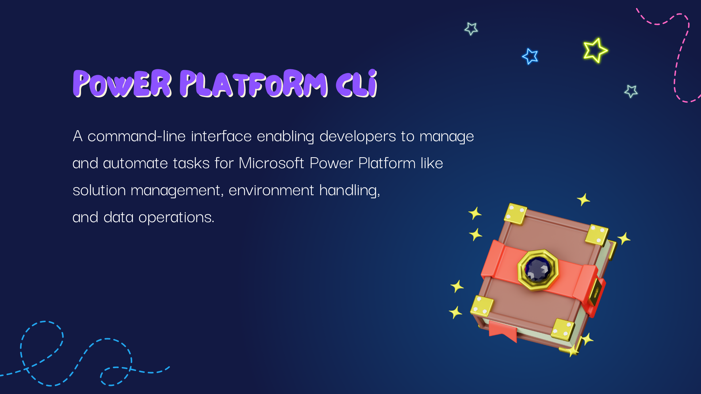
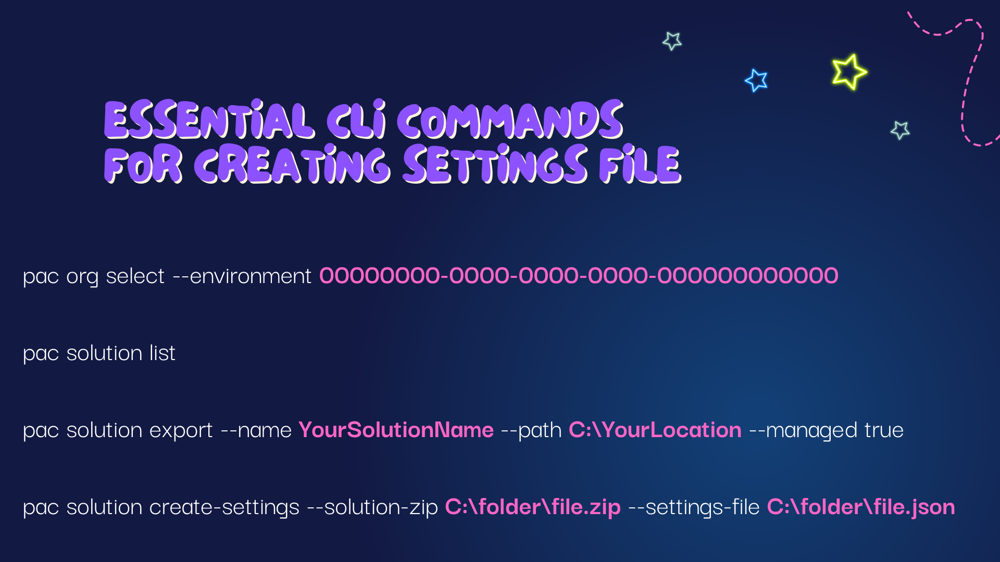
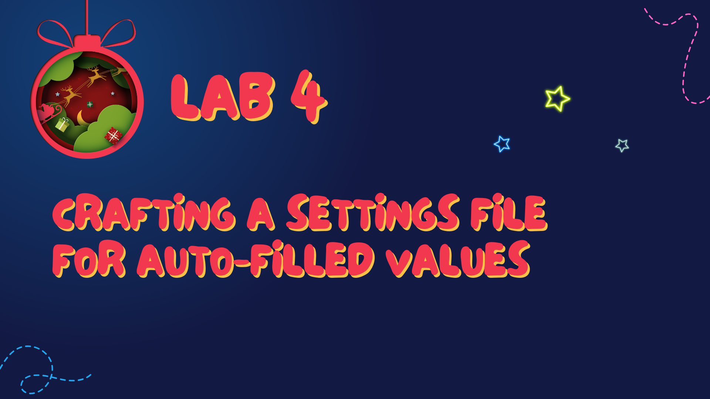

# Chapter 6: Automation Arctic

Venturing further into our winter wonderland, we reach Chapter 6: Automation Arctic, a realm where the crisp, cold air is filled with the sounds of clicking keyboards and the aura of efficiency. Here, we’ll learn about the Power Platform Command Line Interface (CLI), a tool as essential to our ALM toolkit as a compass is to a North Pole explorer.

---

## Power Platform CLI: The Enchanted Tool

The Power Platform CLI is the wizard's wand for the Power Platform, allowing us to cast spells (commands) that can automate repetitive tasks, manage environments, and control the lifecycle of our applications. It's a command-line utility that brings the magic of automation to our fingertips, helping us to perform complex operations with simple incantations.

---

## Utilizing the CLI in Our Workshop

In our festive workshop, the CLI can be used for a variety of tasks:

**Organization Management**: `pac org select` allows us to choose and manage the Power Platform environment we wish to work within, much like selecting the best tree to place our gifts under.

**Solution Management**: `pac solution list` shows us all the solutions available in the selected environment, akin to checking our list of toys. With `pac solution export`, we can package a solution, like wrapping a present, ready to be shipped. It's our way of putting a bow on our work, ensuring that every component is neatly bundled together. For initiating a fresh batch of configurations, `pac solution create-settings` is our go-to command. It's akin to mixing a new batch of holiday cookie dough, carefully choosing our ingredients to ensure the perfect blend for a delightful treat. This command allows us to create a settings file that pre-defines certain parameters and configurations for our solution, making sure that when we're ready to 'bake' our app, everything is set just right.

---

## Fourth Lab: Crafting a Settings File for Auto-Filled Values

Our fourth lab invites you to don your wizard's hat as we craft a settings file that auto-fills values for environment variables and connection references. This file is like a recipe card that holds all the secret ingredients and measurements for a perfect batch of gingerbread cookies.

By the end of this lab, you’ll be able to:

- Utilize essential Power Platform CLI commands to streamline your development process.
- Create a settings file that automatically populates with the necessary values, ensuring that your environments are always in sync.

[Go to the Lab 4](./labs/Lab%204%20-%20Crafting%20a%20Settings%20File%20for%20Auto-filled%20Values.md)

---

With our settings file in hand and our CLI commands mastered, our sleigh is now packed with all the tools we need for a seamless deployment. Let’s bid farewell to the serene Automation Arctic and set our course towards [Chapter 7: Deployment Deck-the-Halls Dock](./Chapter7%20-%20Deployment%20Deck-The-Halls%20Dock.md). Here, we’ll get into the spirit of releasing our solutions, wrapping up our work with the precision and joy of the holiday season, ready to be delivered and unwrapped by users across the globe.

---

