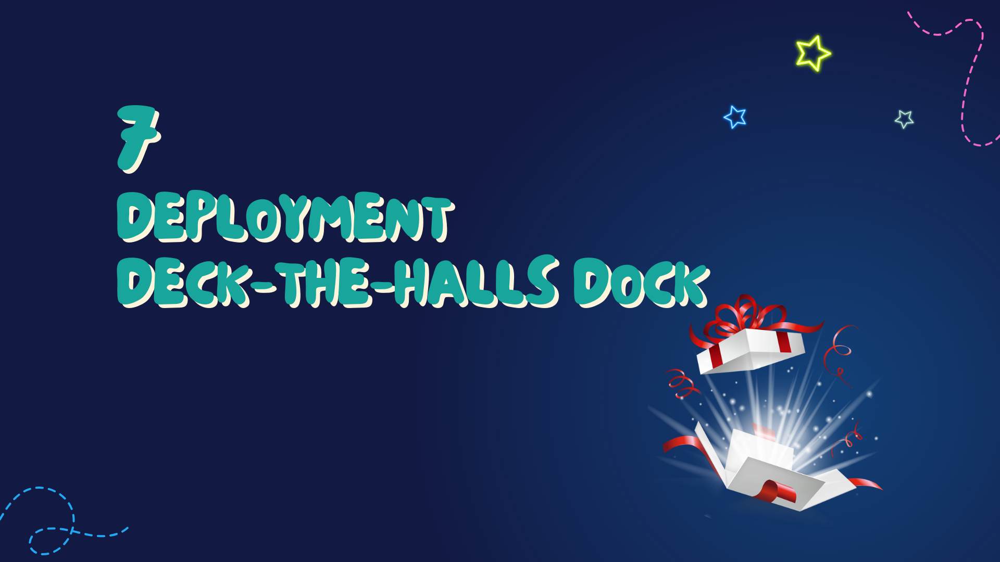
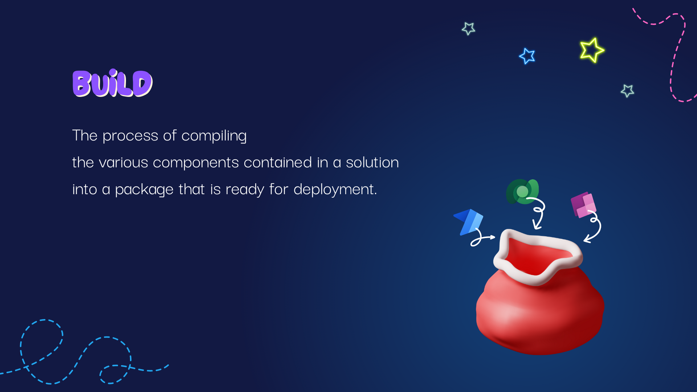
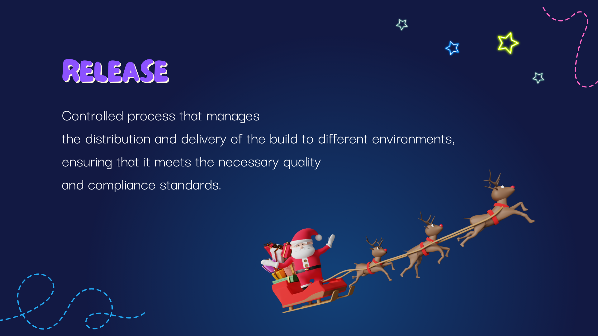
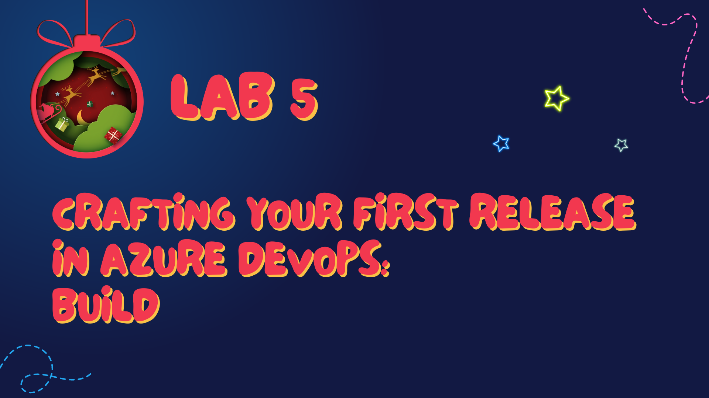
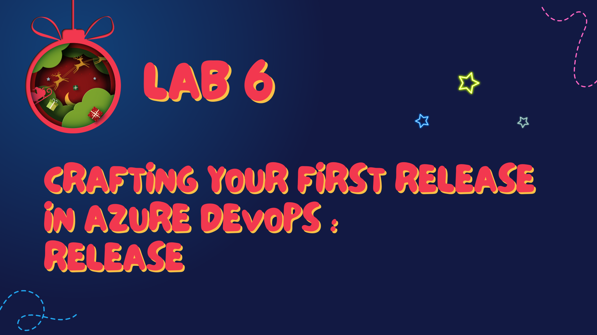

# Chapter 7: Deployment Deck-The-Halls Dock

As we journey to Chapter 7: Deployment Deck-the-Halls Dock, we find ourselves in the bustling hub where all preparations culminate in the grand display of our work—the deployment process.

---

## Understanding Build and Release

In the realm of application development, **Build** and **Release** are the two magical processes that bring our ALM journey towards its crescendo.

**Build**: This is akin to the toy-making itself. Here, we compile our code, run tests, and assemble our application's components into a single deployable unit. It's like the elves crafting toys, ensuring everything fits together perfectly and is ready for the wrapping.

**Release**: This process is where the toys are wrapped, the sleigh is loaded, and the gifts are delivered. It's the act of deploying the builds to the production environment, making them available to the end-users. In essence, it's when the toys leave Santa’s workshop and begin their journey to the children around the world.

---

## Fifth Lab: Crafting Your First Release in Azure DevOps - Build

Our fifth lab invites you to the workshop table, where you'll craft your first build. You'll learn how to:

- Configure build pipelines in Azure DevOps, ensuring that our code is compiled, and ready to be packaged.
- Automate the build process, making sure that every code check-in triggers a build, much like how every letter to Santa triggers a toy to be made.

[Go to the Lab 5](./labs/Lab%205%20-%20Crafting%20Your%20First%20Release%20in%20Azure%20DevOps%20-%20Build.md)

---

## Sixth Lab: Crafting Your First Release in Azure DevOps - Release

Following our successful build, we'll move on to wrapping the gifts. In the Lab 6, you'll:

- Create a release pipeline that takes the compiled build and deploys it to the production environment.
- Configure pre-deployment and post-deployment conditions, ensuring that our application is released under the right circumstances, like making sure each gift is delivered to the correct house.

[Go to the Lab 6](./labs/Lab%206%20-%20Crafting%20Your%20First%20Release%20in%20Azure%20DevOps%20-%20Release.md)

With the completion of these Lab 5 and Lab 6, you’ll have the knowledge and practical experience to build and release applications within Azure DevOps, setting the stage for many successful deployments to come.

---

As we carefully place the last of our presents into the sleigh and ensure every bow is tied, our deployment phase comes to a close. With our applications built and released, it’s time to journey to our final destination, [Chapter 8: Elf’s Exploration Echo](./Chapter8%20-%20Elfs%20Exploration%20Echo.md). Here, we’ll reflect on the paths we've traveled, the skills we've honed, and look forward to the continuous exploration and improvement of our ALM practices. Let's take our ALM sleigh down this last stretch, reminiscing about our journey and anticipating the exciting paths yet to be explored.

---

