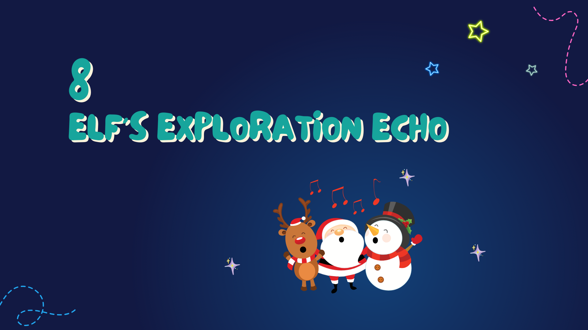
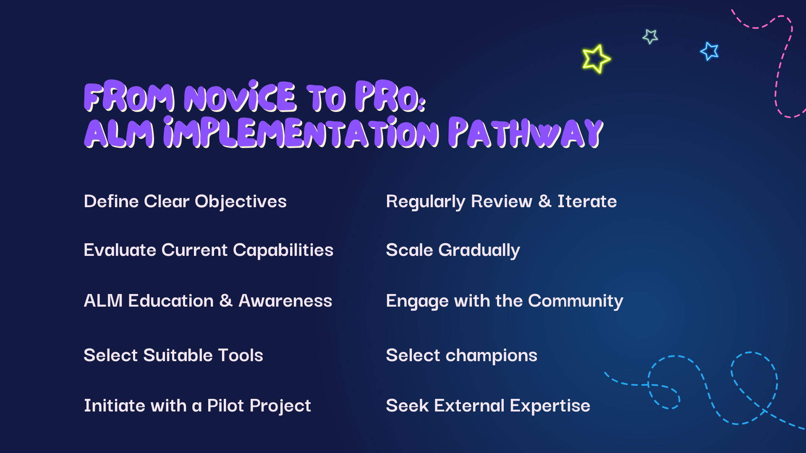
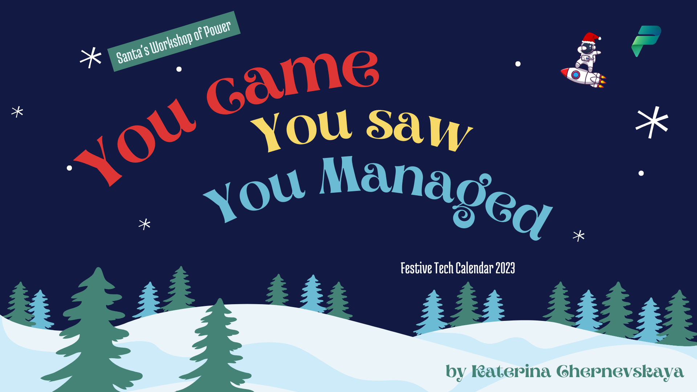

# Chapter 8: Elf's Exploration Echo

As we pause in the hush of the Elf's Exploration Echo, we reflect on the wondrous path we've taken together. From the initial curious steps into the world of ALM to mastering its tools and tricks, we've journeyed through a landscape that was once shrouded in the mysterious northern lights of the unknown but now glows warmly with familiarity and understanding.

---

## Growth Path: From Novice to Pro

As we bask in the glow of our accomplishments, let's remember that the end of one journey marks the beginning of another. The path of learning is evergreen, much like the steadfast pines of the North Pole.

Here at the threshold of a new chapter, we stand not at the end, but at a vantage point where we can see the path stretching out before us. It's a trail that leads from the cozy comfort of the novice's hearth to the exhilarating peaks known only to the pros—a journey of continuous growth and development.

**Define Clear Objectives**: Chart your course through the stars. Know your destination to navigate the skies with purpose and precision.

**Evaluate Current Capabilities**: Take stock of your sleigh and reindeer. Understanding your current setup ensures you can plot a course true to your capabilities.

**ALM Education & Awareness**: Study the ancient carols and lore of ALM. Knowledge is the light that guides us through the darkest winter nights.

**Select Suitable Tools**: Choose your tools with care, as a craftsman selects the finest wood and sharpest tools to create toys that will last generations.

**Initiate with a Pilot Project**: Begin your journey with a single step. A pilot project is the first footprint in the fresh snow, leading the way for others.

**Regularly Review & Iterate**: Like the cycles of the moon, regularly review and refine your work. Each iteration brings a new phase of brilliance.

**Scale Gradually**: Allow your ALM practice to grow like a pine tree, steadily and strong, reaching higher with each passing year.

**Engage with the Community**: Join in the grand chorus of the community. Share your songs and learn from the harmonies of others.

**Select Champions**: Appoint your bravest and brightest elves as champions who will carry the torch of ALM into the new year.

**Seek External Expertise**: Sometimes, the wisdom of the ancient wizards is needed. Seek mentors and experts who can provide guidance on your journey.

---

Now, as our workshop draws to a close and the star atop our tree shines the brightest, we look ahead to the future. The gifts of knowledge you've unwrapped here will serve you not just this festive season but in the many years to come. May the ALM skills you've honed be the guiding star in your professional endeavors, leading you to new heights of innovation and success.

And so, with hearts full of cheer and minds enriched with new wisdom, we bid farewell to this chapter of our journey. I wish each and every one of you the happiest of holidays. May your code run flawlessly, your deployments be smooth, and your festive season be filled with joy.

Merry Christmas to all, and to all a good code! May your days be merry, your nights starlit, and your new year bright with the promise of continued exploration and discovery.
