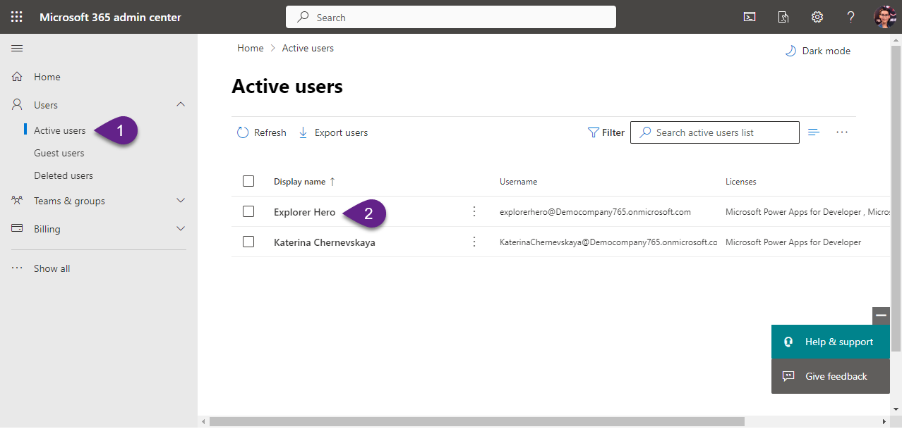
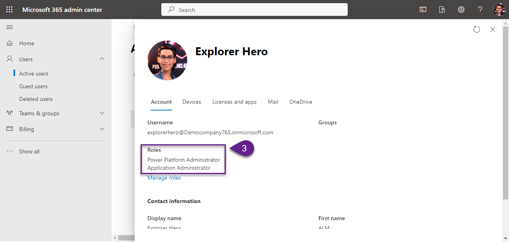
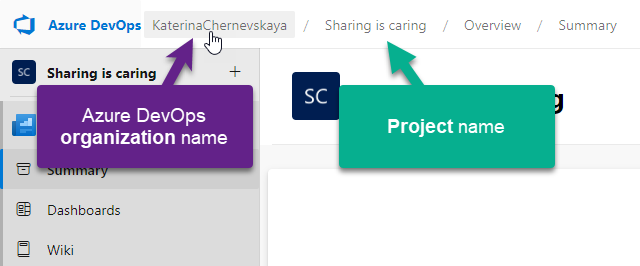

# Santa's Workshop of Power

## Elf Equipment check

Welcome to the festive launchpad of our ALM expedition! As we gear up for a journey filled with learning and creation, it's essential to ensure your sleigh is packed and the reindeer are ready. This guide is your checklist, making sure you're all set for a smooth takeoff into our hands-on labs. Let's double-check that your workshop is decked out with all the tools and trimmings needed for our adventure!

## 1. Laptop
**Task:** Confirm your laptop is fully charged and in tip-top shape.

**Outcome:** A trusty device to guide you through the labs without a glitch, just like Rudolph guides the sleigh through the fog.

***

## 2. Tenant with Microsoft 365 subscription
**Task:** Secure an active tenant with a Microsoft 365 subscription.

:exclamation: _Note:
A trial version is fine; think of it as the temporary workshop for your toy-making. Kick-off with a new tenant [here](https://signup.microsoft.com/get-started/signup?products=91dcd8b1-3b1b-444d-9cdb-0bc0da3eb40d&mproducts=CFQ7TTC0LH18:0002&fmproducts=CFQ7TTC0LH18:0002&culture=en-us&country=us&ali=1)._

**Outcome:** A digital realm to construct and deploy your solutions, much like Santa's own workshop.

***

## 3. Ensure Assigned Roles
**Task:** Check that you're the Chief Elf with `Power Platform Administrator` and `Application Administrator` roles in your tenant.

:exclamation: _Note:
These roles are your all-access pass to Santa's workshop, making sure you can jingle all the way through the labs._

**Outcome:** Full reign over the Power Platform's capabilities, ensuring a jolly good workshop experience.

**Checking path:**
1. Navigate to [https://admin.microsoft.com/](https://admin.microsoft.com/).
2. In the `Users` then `Active users`. Find and click on your account.
3. Confirm that you're donning the `Power Platform Administrator` and `Application Administrator` hats.

***

## 4. Power Apps Developer Plan Activated in your tenant
**Task:** Activate the Power Apps Developer Plan in your tenant to unlock the full toy-making kit.

:exclamation: _Note:
Start the plan [here](https://powerapps.microsoft.com/en-us/developerplan/) and get ready to tinker with all the bells and whistles._

**Outcome:** A treasure chest of Power Apps features at your fingertips.

***

## 5. Two Power Platform Environments created
**Task:** Craft two distinct Power Platform environments: one for building toys (DEV) and the other for displaying them (TEST).

:exclamation: _Note:
Think of DEV as the elves' workshop and TEST as the window display._

**Outcome:** The perfect duo of environments to practice your CI/CD carols.

***

## 6. Unmanaged Solution Imported in Dev Environment
**Task:** Make sure your DEV environment is like Santa's sack, filled with an unmanaged demo solution "North Pole Communication Kit".

:exclamation: _Note:
Download the solution [here](./SantaStorage/NorthPoleCommunicationKit_1_0_0_1.zip) as if you're pulling toys from Santa's bag._

**Outcome:** A workshop bustling with all the necessary tools for our ALM crafting.

***

## 7. Azure DevOps Organization in your tenant
**Task:** Create an Azure DevOps Organization in your tenant, setting up a command center for the elves.

:exclamation: _Note:
You can start for free and set up your command center [here](https://dev.azure.com/)._

**Outcome:** A central hub for orchestrating the elves' dance of development and deploymentp.

***

## 8. Enable Free Tier for Parallelism in Azure DevOps Organization
**Task:** Ensure that the free tier for parallelism is enabled in your Azure DevOps to keep the workshop elves working in harmony.

:exclamation: _Note:
Request the free tier of Parallelism for your organization through [this form](https://forms.office.com/pages/responsepage.aspx?id=v4j5cvGGr0GRqy180BHbR63mUWPlq7NEsFZhkyH8jChUMlM3QzdDMFZOMkVBWU5BWFM3SDI2QlRBSC4u) form, allowing for a symphony of simultaneous operations. The free tier for parallelism typically requires a 2-day approval._

**Outcome:** A finely tuned Azure DevOps setup, ready for the elves' ensemble.

**Navigating the Setup of Your Azure DevOps Organization**
Follow the below steps to set your Azure DevOps organization prepared in advance to make the most of our workshop.

1. Visit https://dev.azure.com/
2. Create a new project and hit `Continue`
3. Navigate to the [Azure DevOps Parallelism Request form](https://forms.office.com/pages/responsepage.aspx?id=v4j5cvGGr0GRqy180BHbR63mUWPlq7NEsFZhkyH8jChUMlM3QzdDMFZOMkVBWU5BWFM3SDI2QlRBSC4u), fill out the questions, and submit.
- in the question `What is your name?` write your name
- in the question `What is your email address?` write your email address from the tenant for which you make the request
- in the question `What is the name of your Azure DevOps Organization?` write the link to your Azure DevOps organizatopn (like https://dev.azure.com/KaterinaChernevskaya)
_To locate this link, click on the organization name associated with your newly created project and copy the URL from the address bar._

- in the question `Are you requesting a parallelism increase for Public or Private projects?` select `Private`

***

## 9. Visual Studio Code installed
**Task:** Have Visual Studio Code installed on your sleigh's dashboard. If it's missing, download it [here](https://code.visualstudio.com/), like picking the perfect candy cane from the bunch.

**Outcome:** Ready to navigate through the deployment process with the precision of Santa's sleigh.

***

