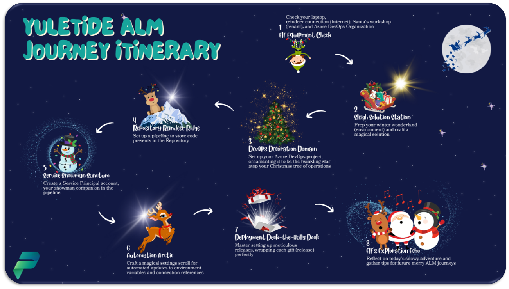

# Santa's Workshop of Power

## Welcome to the Yuletide ALM Journey Itinerary 🎄🌟
Greetings, festive code crafters and Power Platform enthusiasts!

You've arrived at a very special corner of the Festive Tech Calendar — the Yuletide ALM Journey Itinerary. Here, within this repository, lies a series of festive and informative labs designed to guide you through the wonderous world of Application Lifecycle Management within the Power Platform.

As your Cosmic Elf Captain on this journey, I'm delighted to lead you through a land of learning where time is a gift — yours to open and enjoy at your leisure. So, whether you're an early bird who catches the worm or a night owl who revels under the starlight, you can navigate these labs at your own pace, on a day that suits you best.

[Start your journey here](./Chapter1%20-%20Intro.md)

---

## 🌟 What to Expect
Our Yuletide ALM Journey Itinerary, depicted above, outlines the merry milestones we'll visit. Each one is packed with insights and activities, ready for you to unwrap and savor.

## 🕛 The Doors Open at Midnight
As December 14th dawns, this repository will come alive with the spirit of the season. Content, rich with knowledge and hands-on practice, will appear — ready for you to engage with when the time is right for you.

## 📝 Preparing for the Journey
Before you hitch your reindeer to the sleigh:

- Ensure you have completed all the prerequisites outlined [here](./CheckPrerequisites.md).
- Acquaint yourself with the necessary tools and permissions.
- Get ready for an adventure filled with learning, collaboration, and festive fun!

## 🤝 Stay Connected and Supported
Don't forget to star and watch this repository to catch every content update, as delightful as the season's first snowfall. And if you wish to share your ALM experiences, or if questions arise like curious reindeer, simply [drop me a message](https://www.linkedin.com/in/katerinachernevskaya/). Our collaboration will be the bow that ties this gift together.

And remember, the [Festive Tech Calendar](https://festivetechcalendar.com/) is just a click away, filled with more tech adventures to enrich your holiday season.

With the fire crackling and the hot cocoa steaming, we're ready to settle into this cozy, self-guided workshop. Join us for this part of the **Festive Tech Calendar** and let's code our way to a merry and bright ALM expertise.

Happy Holidays, and here's to a season filled with peace, joy, and code!