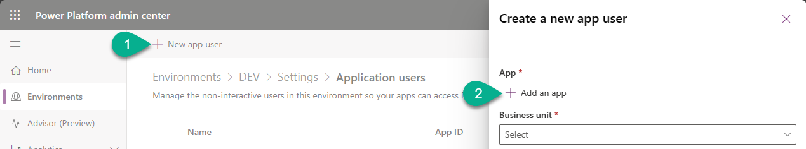
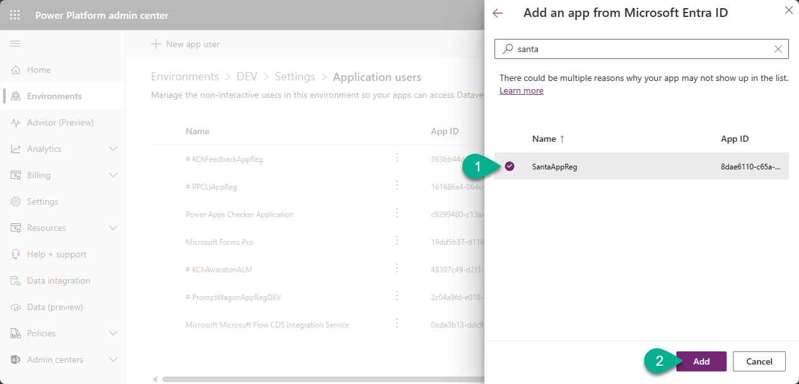
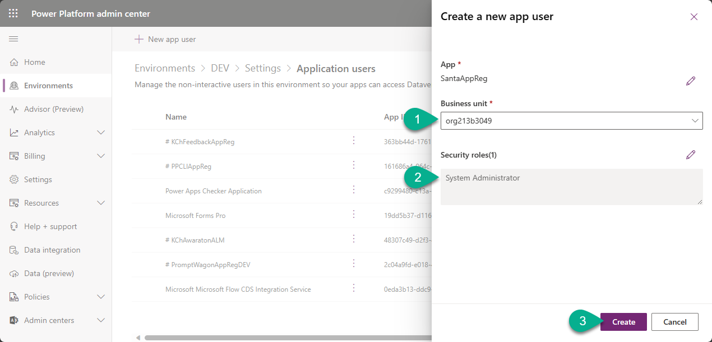
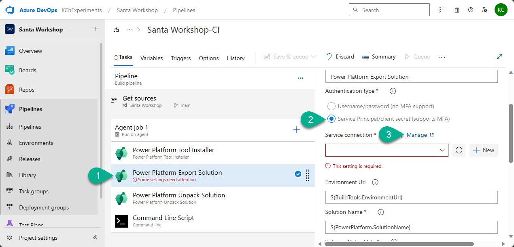

# Lab 3. Integrating Service Principal with Azure DevOps Pipelines

# 1. Create App Registration

1. Navigate to [https://portal.azure.com/](https://portal.azure.com/).

2. In the search field type `registration` and in the drop-down list select `App registration`.

3. Click `New registration` on the `App registrations` page.

4. Enter `SantaAppReg` in the `Name` field, keep other fields with predefined values and click `Register`.

5. Once the app registration is created, navigate to `API permissions` on the left-hand menu.

6. Click `+ Add a permission`.

7. In the pop-up window find and choose `Dynamics CRM`.

8. Select `user_impersonation` and click `Add permissions`.

9. Click `Grant admin consent for YOUR COMPANY NAME` and click `Yes` in the pop-up window.

10. Navigate to `Certificates & secrets`.

11. Click `+ New client secret`.

12. Enter `SantaSecret` in the `Description` field and click `Add`.

13. Copy secret from the `Value` field and store it somewhere (in Notepad for instance).

:exclamation: _Note:
Once you close this tab or navigate somewhere from this screen, the Secret value won't be available for copy._

14. Navigate to `Overview` and copy value from fields `Application (client) ID` and `Directory (tenant) ID`.

***

# 2. Add the Service Principal into Power Platform

1. Navigate to [Power Platform admin center -> Environments](https://admin.powerplatform.microsoft.com/environments).

2. Open `DEV` environment.

3. Click `See all` bellow `Users`.

4. Click `app users list` in the opened screen.

5. Click `+ New app user`, and in the pop-up window click `+ Add an app`.

6. Select `SantaAppReg` and click `Add`.

7. Select `Business unit`, add either `System Customizer` or `System Administrator` security role, and click `Create`.

8. Repeat all steps in this section for the `PROD` environment.

*** 

# 3. Create Connection in Azure DevOps using App Registration

1. Navigate to your project in Azure DevOps and open `Pipelines` tab on the left-hand menu.

2. Click on three dots for the pipeline that you created in the previous lab, and click `Edit`.

3. Go to the step `Power Platform Export Solution` and switch `Authentication type` to `Service Principal/client secret (support MFA)`. After click `Manage` next to `Service connection`.

4. Click `New service connection`.

5. Select `Power Platform` and click `Next`.

6. Fill in the form:
- `Authentication method` - `Application Id and client secret`.
- `Server URL` - get this value from Power Apps Maker portal (see bellow).
- `Tenant Id` - `Directory (tenant) ID` that you copied on step 1.
- `Application Id` - `Application (client) ID` that you copied on step 1.
- `Client secret of Application Id` - Secret value that you copied on step 1.
- `Service connection name` - `Dev Service Principal`.

:exclamation: _Note:
To find value for_ `Server URL` _field go to Power Apps maker porta, select environment_ `Dev` -> `Settings` -> `Session details`

Click `Save`.
Completed form should look as the following:

7. Go back to your pipeline, refresh `Service connection` field and select `Dev Service Principal`.

8. Go to your solution and update value of the `ElfPalette` environment variable. The new value - `#0AFF3F`.
Run this updated pipeline. 

***

# 4. Check the result

Once the run will be completed successfully, go to `Repos`, select the folder `NorthPoleCommunicationKit` and check the `History`.

***

[Go back to the chapter 5](../Chapter5%20-%20Service%20Snowman%20Sanctum.md#third-lab-crafting-our-snowman-for-azure-devops-pipelines)

