# Lab 4. Crafting a Settings File for Auto-filled Values

# 1. Install Microsoft Power Platform CLI

1. Open **Visual Studio Code** on your laptop.

:exclamation: _Note:
The web version of Visual Studio Code is not suitable because it does not support PAC CLI_

2. Select `Extensions` from the Activity panel.

3. In the search bar, enter `Power Platform Tools`.

4. Select `Install`. 

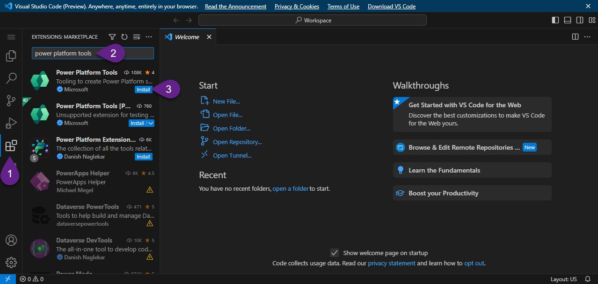

Once the installation is finished, restart Visual Studio Code to see the extension within the Terminal window.

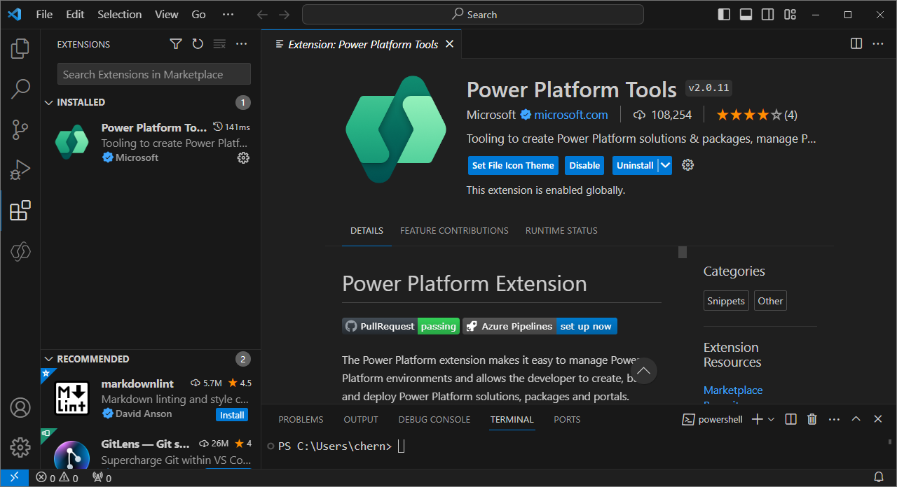

***

# 2. Create a new Auth Profile

1. Select `Power Platform` from the Activity panel.

2. In the `Power Platform` section click `+` icon to add a new Auth Profile.

:exclamation: _Note:
If you didn't use Power Platform CLI yet, your Auth Profiles list will be empty._

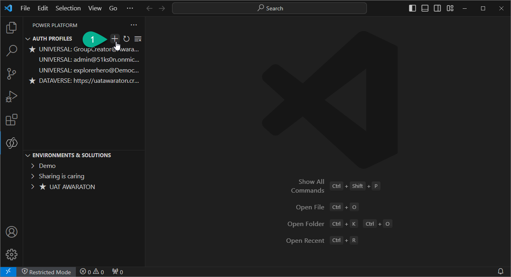

3. Enter your credentials.

4. Check that a new profile appeared and marked with star.

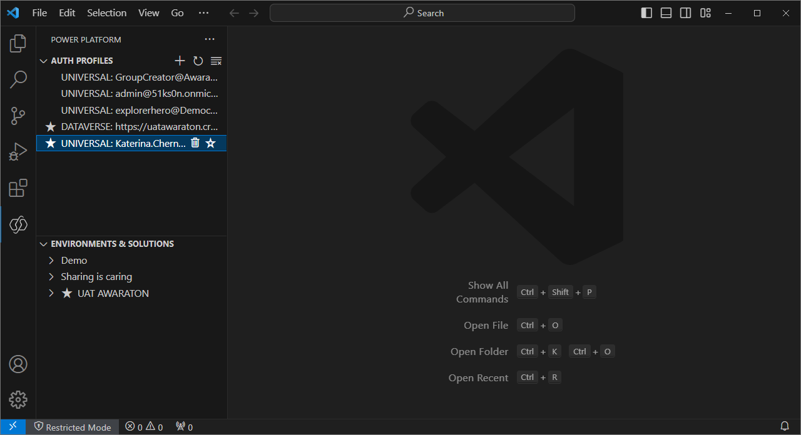

***

# 3. Generate Settings file

1. In the `View` drop-down select `Terminal.

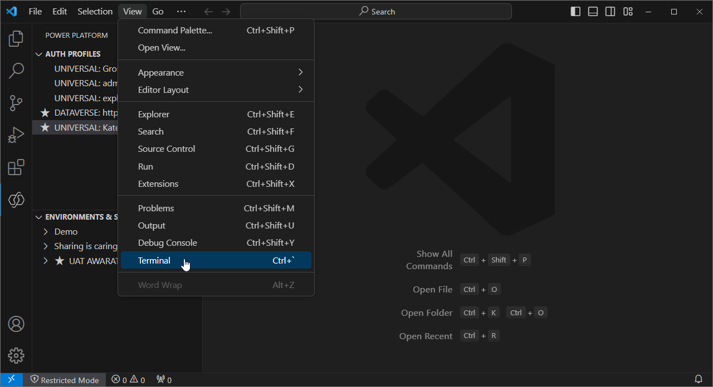

2. Enter the following command in the `Terminal` window and run it to select `DEV` environment:

`pac org select --environment 00000000-0000-0000-0000-000000000000`

:exclamation: _Note:
Please replace **00000000-0000-0000-0000-000000000000** with your environment ID. You can find the environment ID in the **Session details**:_

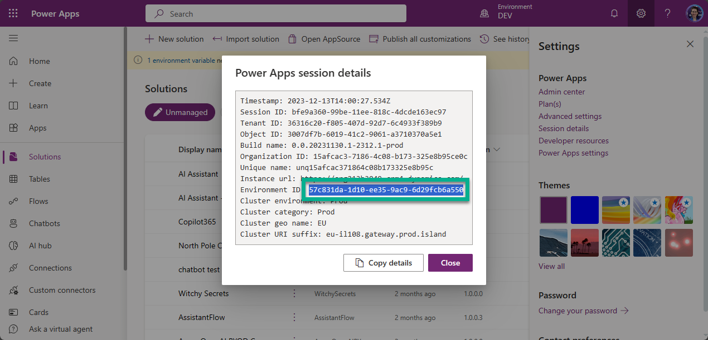

3. Enter the following command in the `Terminal` window and run it to export the solution **North Pole Communication Kit**:

`pac solution export --name NorthPoleCommunicationKit --path C:\NorthPole --managed true`

:exclamation: _Note:
If you work with your own solution, replace **NorthPoleCommunicationKit** with the name of your solution_
_If you don't remember by heart your solution's name, run the following command to see all solutions in selected environment:_
`pac solution list`

4. Enter the following command in the `Terminal` window and run it to create a setting file:

`pac solution create-settings --solution-zip C:\NorthPole\NorthPoleCommunicationKit_managed.zip --settings-file C:\NorthPole\settings.json`

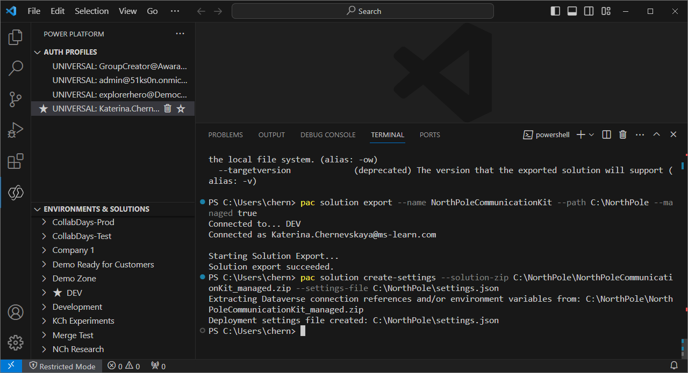

***

# 4. Edit Settings file

1. Open created settings file.

:exclamation: _Note:
You can find the settings file in the folder which you enter as value for `--settings-file` last command._

The settings file should include all environments variables and connection references:

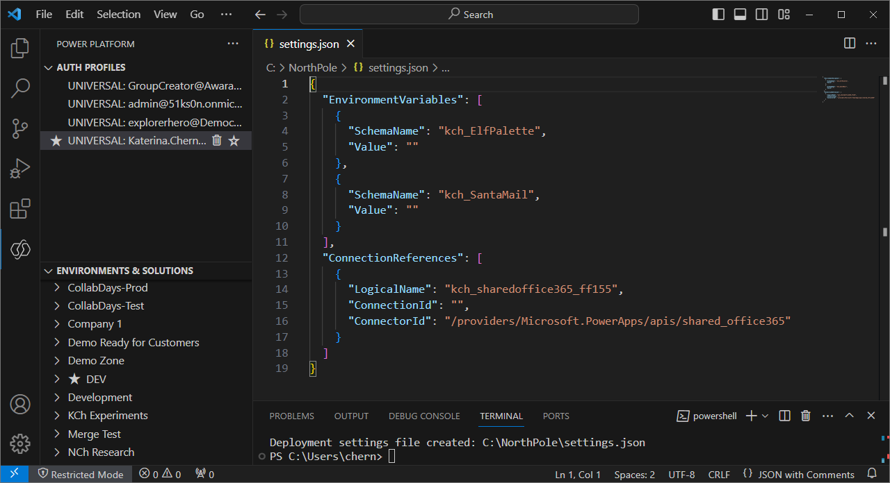

2. Enter values in 5 and 9 rows:
- in row 5 add value `#FFFF00`
- in row 9 add a new email address
- in row 15 add the ID of a connection reference from the PROD environment.

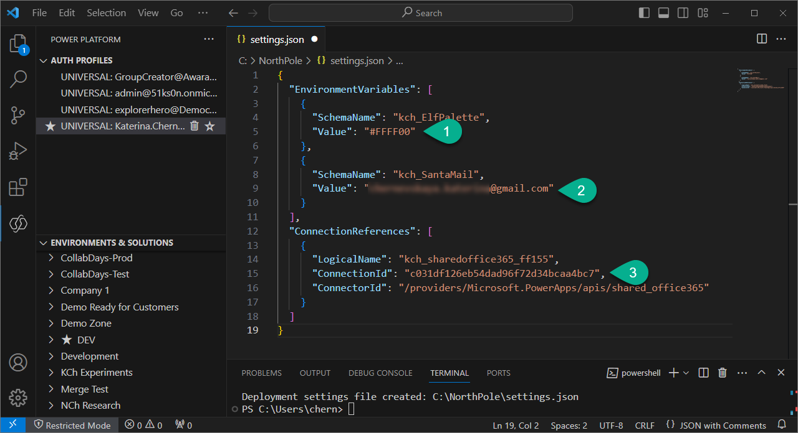

:exclamation: _Note:
You might need to add a new connection reference in the PROD environment. Once you have the connection reference in the PROD environment - copy its ID from the URL:_
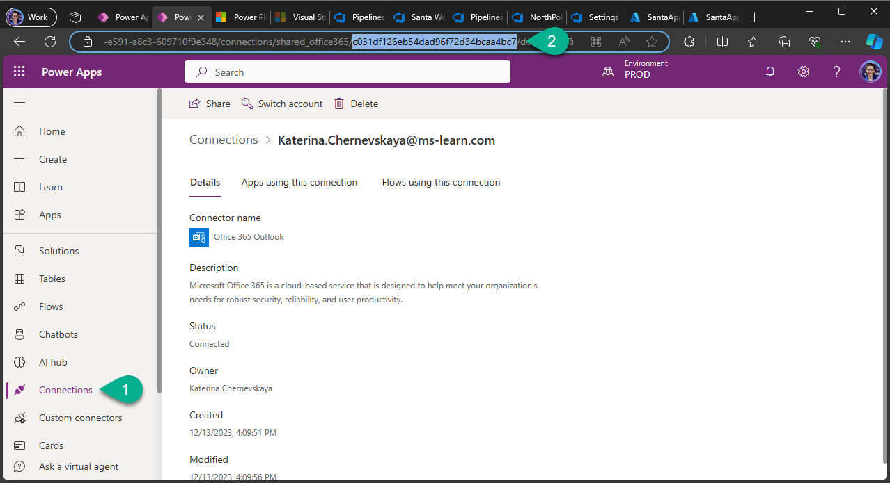

:exclamation: _Note:
Don't forget to share this connection with your app registration:_
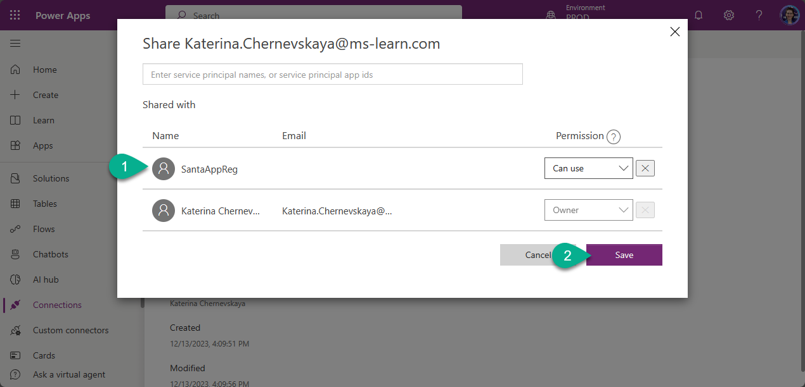

3. Save the file (press `Ctrl` + `S`). Do not close the file.

***

# 5. Add Settings file into Repository

1. Go to `Repos` in Azure DevOps.

2. Click on three dots next to the Repo name `Santa Workshop`.

3. Select `+ New`, and then select `Folder`.

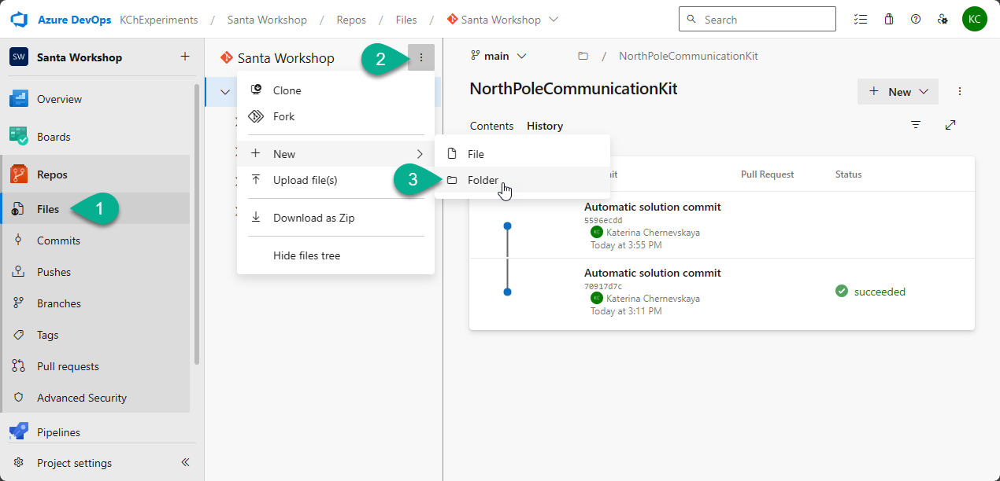

4. Provide the following information:
- `New folder name` - `Settings`
- `New file name` - `SantaWorkshop.json`

5. Click `Create`.

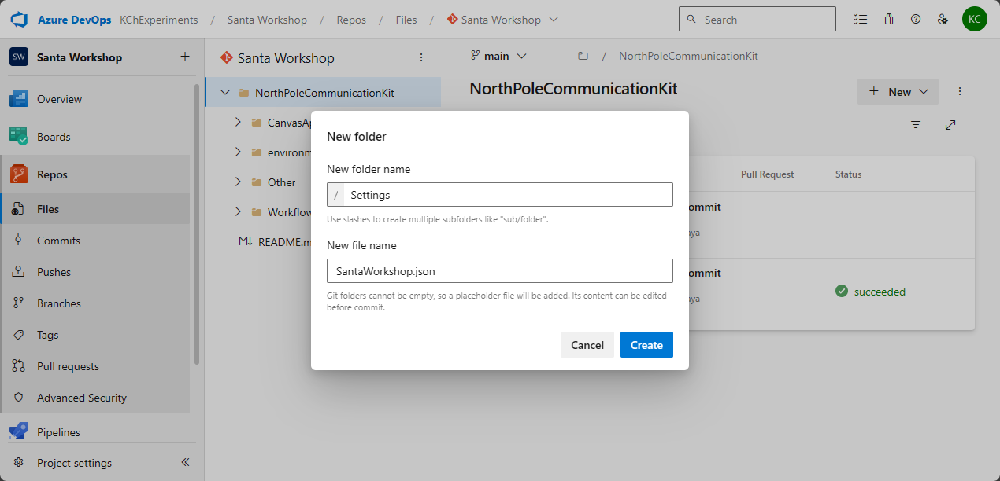

6. Copy all rows from the settings file on your laptop to this `SantaWorkshop.json` file, and click `Commit`.

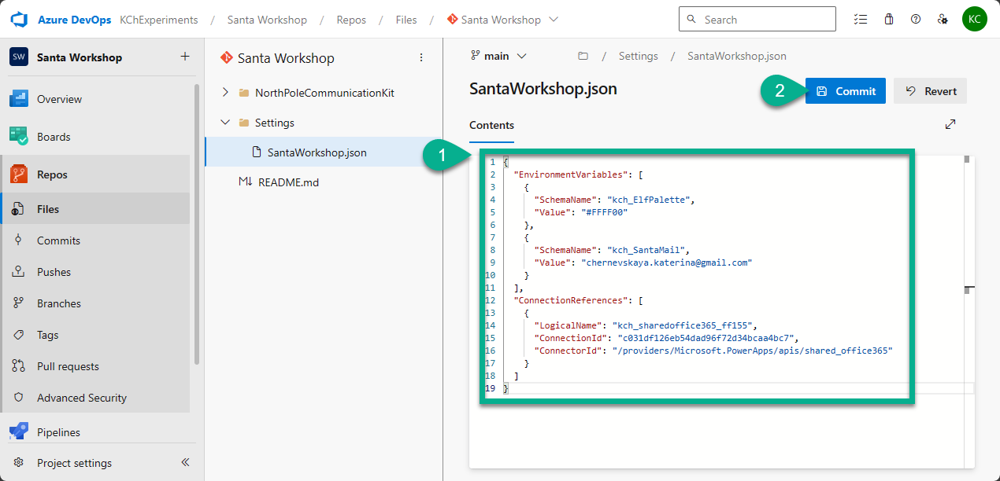

7. In the pop-up window click `Commit`.

***

[Go back to the chapter 6](../Chapter6%20-%20Automation%20Arctic.md#fourth-lab-crafting-a-settings-file-for-auto-filled-values)