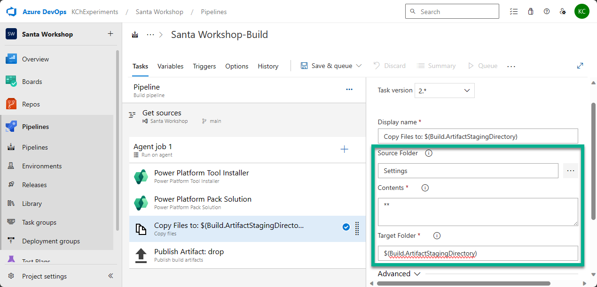

# Lab 5. Crafting Your First Release in Azure DevOps: Build

# 1. Create Build pipeline

1. Navigate to `Pipeline` and click `New pipeline`.

2. As we proceed during the creation of the first pipeline, select `Use the classic editor` -> click `Continue` -> `Empty job`.

3. Rename pipeline with `Santa Workshop-Build`

4. Uncheck `Shallow fetch` in `Get source`.

5. Add the following tasks to `Agent job 1`:

- `Power Platform Tool Installer`
- `Power Platform Pack Solution`
- `Copy Files to:`
- `Publish Artifacts: drop`

***

# 3. Configure pipeline tasks

## 3-1 Power Platform Pack Solution

### Field: Source Folder of Solution to Pack

Click on three dots and select the folder `NorthPoleCommunicationKit`.

### Field: Solution Output File

Copy to this field the following value:
`$(Build.ArtifactStagingDirectory)\$(PowerPlatform.SolutionName)_managed.zip`

### Field: Type of Solution

Select `Managed`

## 3-2 Copy Files to:

### Field: Source Folder

Click on three dots and select the folder `Settings`.

### Field: Contents

Keep `**`.

### Field: Target Folder

Copy to this field the following value:
`$(Build.ArtifactStagingDirectory)`

## 3-3 Publish Artifact: drop

Keep fields with predefined values.

***

# 4. Set up pipeline variable

1. Go to Variables.

2. Click + Add button.

3. Provide the variable name `PowerPlatform.SolutionName` and its value `NorthPoleCommunicationKit`.

***

# 5. Run pipeline

1. Click `Save & queue`, and click `Save & queue` in the drop-down list.

2. In the Run pipeline pop-up window click `Save and run`.

Once the pipeline will be completed successfully go to the last run and select `1 published; 1 consumed`:

The Artifact will be available:

***

[Go back to the chapter 7](../Chapter7%20-%20Deployment%20Deck-The-Halls%20Dock.md#fifth-lab-crafting-your-first-release-in-azure-devops---build)