# Lab 5. Crafting Your First Release in Azure DevOps: Release

# 1. Create Release

1. Navigate to `Releases`.

2. Select `New pipeline`.

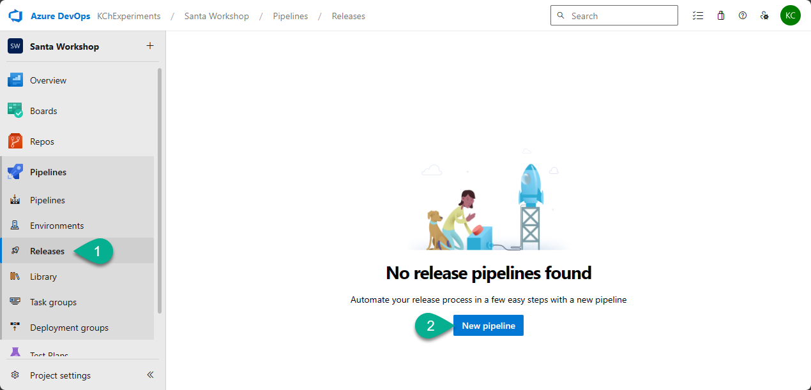

3. Select `Empty job`.

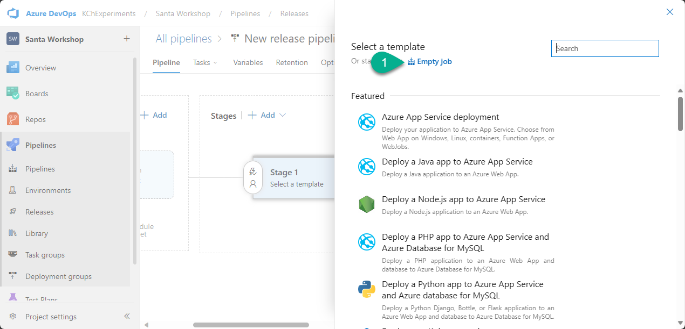

4. Close information pane.

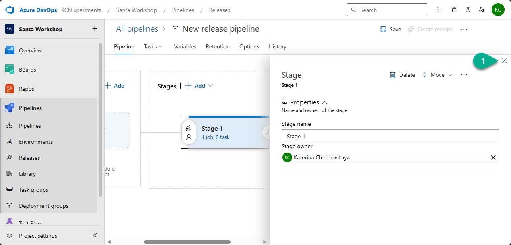

5. Click `+ Add an artifact`

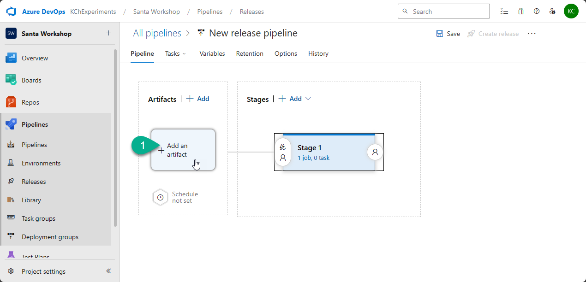

6. Fill in the following fields:
- `Source (build pipeline)` - select `Santa Workshop-Build` (the name of the Build pipeline).
- `Source alias` - `drop`.

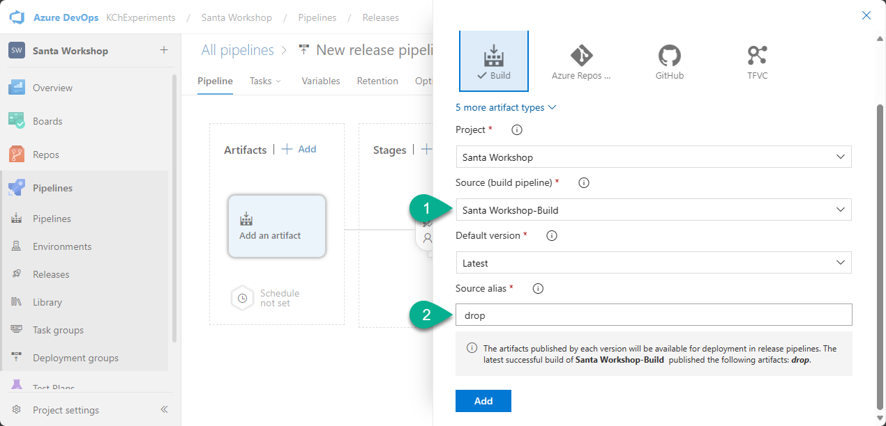

7. Click `Add`.

8. Click `1 job, 0 task`.

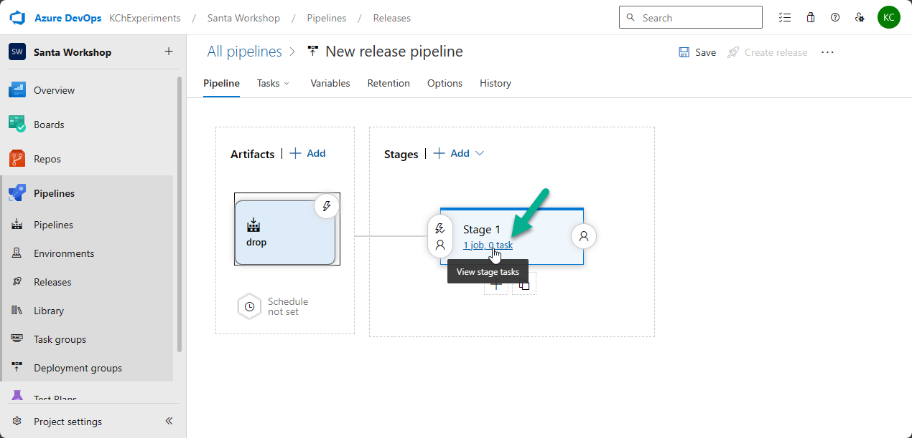

9. Add the following tasks:
- `Power Platform Tool Installer`
- `Power Platform Import Solution`

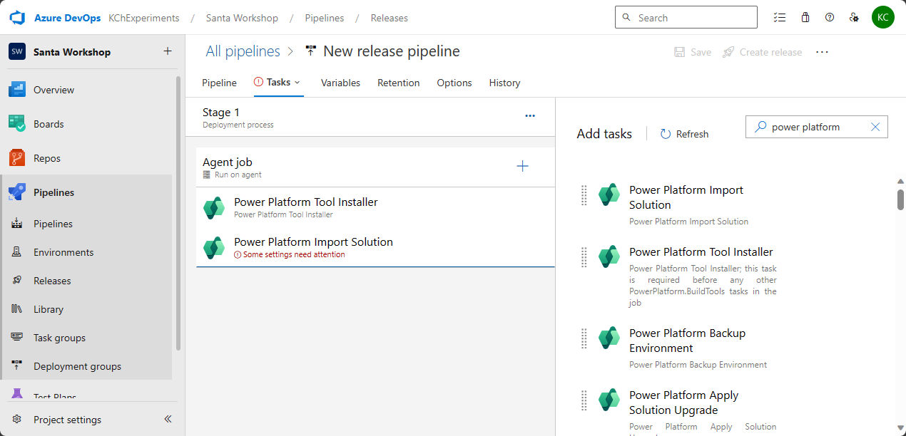

***

# 2. Configure task Power Platform Import Solution

### Filed: Authentication type

Select `Service Principal/client secret (support MFA)`

### Field: Service connection

Select `PROD`

### Field: Solution Input File

Click on three dots, select `NorthPoleCommunicationKit_managed.zip` and click `OK`.

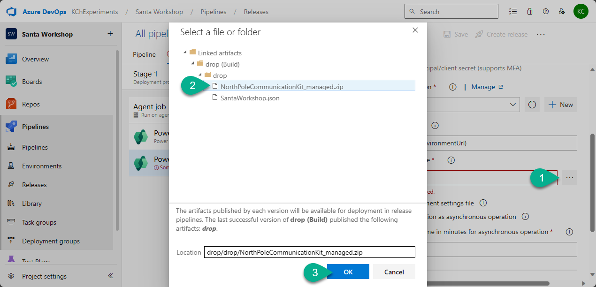

### Field: Use deployment settings file

Ensure that you check this field.

### Field: Deployment Settings File

Click on three dots, select `SantaWorkshop.json` and click `OK`.

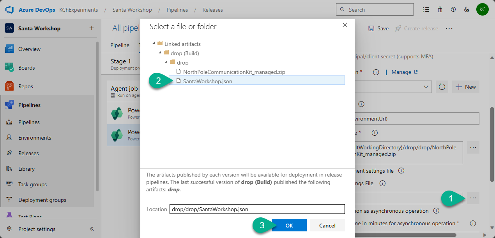

### Section: Advanced

Check `Import as a Managed solution`.

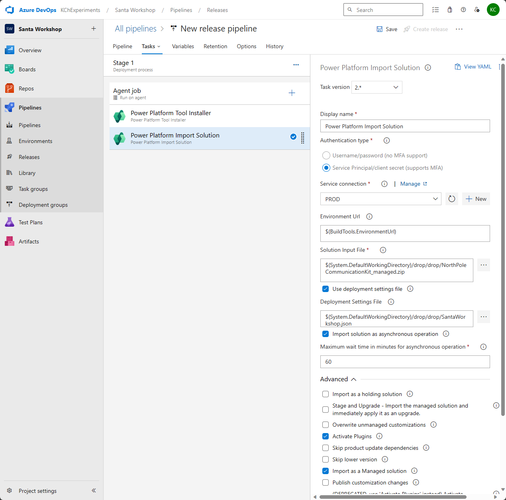

***

# 3. Save and create Release

1. Click `Save`, then click `OK`.

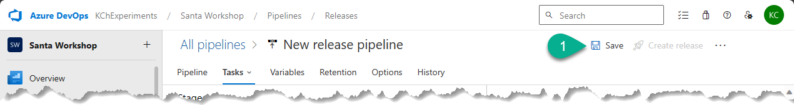

2. Click `Create release, then click `Create`.

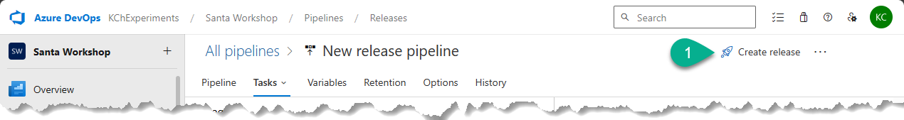

***

# 4. Check PROD environment

1. Go to `PROD` environment.

2. Open the solution `North Pole Communication Kit`.

3. Open the environment variable `ElfPalette` and check that the `Current Value` is `#FFFF00` (as we defined in the Settings file).

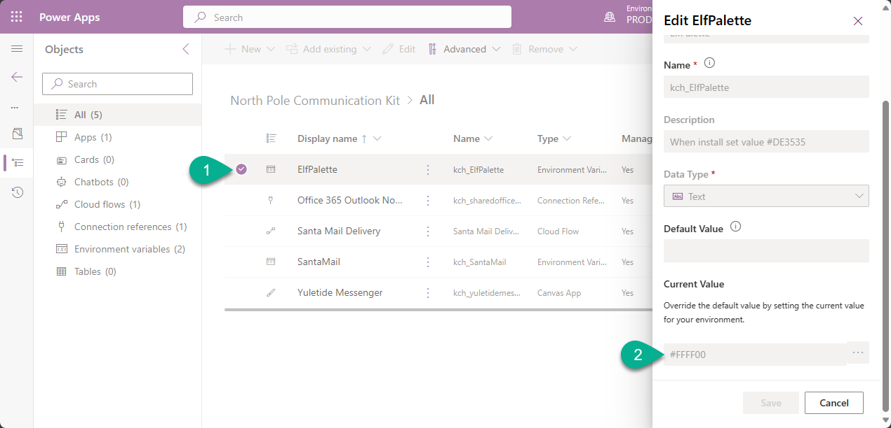

4. Share the app with your account and Play it. 

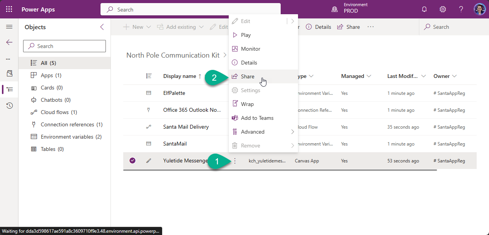

You should see the app with yellow header:

***

[Go back to the chapter 7](../Chapter7%20-%20Deployment%20Deck-The-Halls%20Dock.md#sixth-lab-crafting-your-first-release-in-azure-devops---release)

